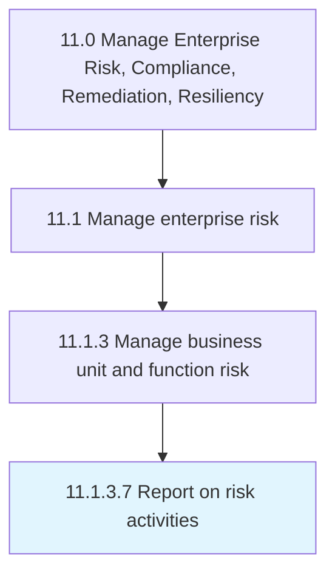

# Report on risk activities

> Creating reports on risk activities, and communicating them to management.

## Overview

Activity 11.1.3.7 is an activity within the Manage Enterprise Risk, Compliance, Remediation, Resiliency framework. 

Creating reports on risk activities, and communicating them to management. Prepare reports on the potential for adverse safety consequences.

## Process Hierarchy



## Key Statistics

| Metric | Value |
|--------|-------|
| APQC Code | 16462 |
| Hierarchy ID | 11.1.3.7 |
| Level | Activity |
| Parent | [11.1.3](../) |
| Sub-Processes | 0 |


## GraphDL Semantic Structure

```
report.OnRiskActivities
```

| Component | Value | Description |
|-----------|-------|-------------|
| Verb | `report` | Primary action |
| Object | `on risk activities` | Direct object |


## Related Concepts

- RiskActivities


---

*Source: APQC PCF 16462 (11.1.3.7) - APQC*
