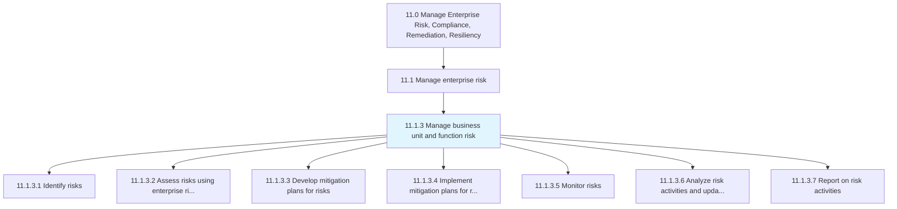
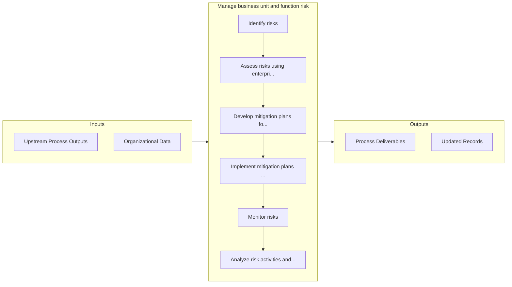

# Manage business unit and function risk

> Analyzing the threats a business unit/function faces to prioritize the controls it implements.

## Overview

Process 11.1.3 is a core process that defines the specific procedures for manage business unit and function risk. 

Analyzing the threats a business unit/function faces to prioritize the controls it implements..

## Process Hierarchy



## Key Statistics

| Metric | Value |
|--------|-------|
| APQC Code | 17462 |
| Hierarchy ID | 11.1.3 |
| Level | Process |
| Parent | [11.1](../) |
| Sub-Processes | 7 |


## GraphDL Semantic Structure

```graphdl
manage.BusinessUnitAndFunctionRisk
```

| Component | Value | Description |
|-----------|-------|-------------|
| Verb | `manage` | Primary action |
| Object | `business unit and function risk` | Direct object |


## Process Flow



## Sub-Processes

| Process | Hierarchy ID | Description |
|---------|-------------|-------------|
| [Identify risks](./IdentifyRisks) | 11.1.3.1 | Developing a timely and continuous process to identify activities that might hinder a project's goal |
| [Assess risks using enterprise risk framework policies and procedures](./AssessRisksUsingEnterpriseRiskFrameworkPoliciesAndProcedures) | 11.1.3.2 | Determining the possibility that a specified undesirable event will occur using established tools, i |
| [Develop mitigation plans for risks](./11.1.3.3-DevelopMitigationPlansRisks/) | 11.1.3.3 | Developing possibilities and arrangements to improve opportunities and reduce deviations to project  |
| [Implement mitigation plans for risks](./ImplementMitigationPlansForRisks) | 11.1.3.4 | Executing mitigation plans to improve opportunities and reduce deviations to project objectives |
| [Monitor risks](./MonitorRisks) | 11.1.3.5 | Identifying, examining, and recognizing/justifying any improbability in investment decision making |
| [Analyze risk activities and update plans](./AnalyzeRiskActivitiesAndUpdatePlans) | 11.1.3.6 | Examining the impact of risk activities in order to update the existing scheme of risk management |
| [Report on risk activities](./ReportOnRiskActivities) | 11.1.3.7 | Creating reports on risk activities, and communicating them to management |


## Related Concepts

- BusinessUnitRisk
- FunctionRisk


---

*Source: APQC PCF 17462 (11.1.3) - APQC*
