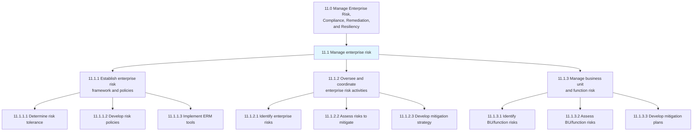
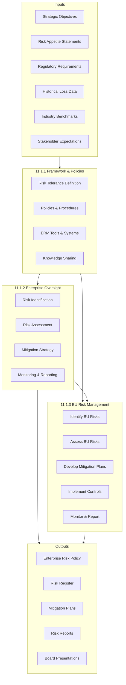
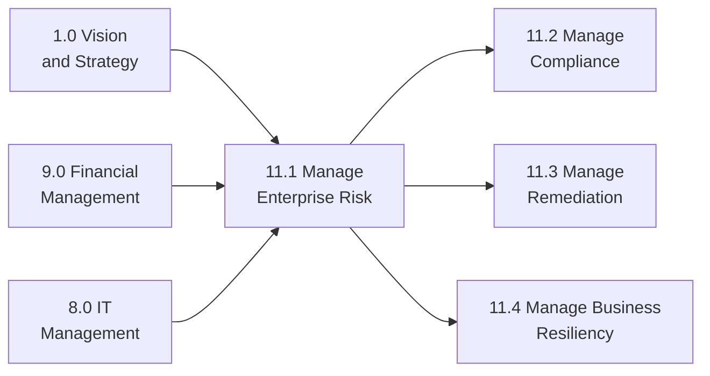

# Manage enterprise risk

> Creating requisite frameworks and coordinating all risk management activities for the entire organization and each function. This process group establishes governance structures, risk policies, and oversight mechanisms that enable informed decision-making and protect stakeholder value.

## Overview

Process Group 11.1 represents the core enterprise risk management (ERM) function that establishes governance structures, coordinates risk activities across the organization, and ensures consistent risk management practices at all levels. This process group encompasses framework development, enterprise-wide risk oversight, and business unit-level risk management.

Effective enterprise risk management integrates risk considerations into strategic planning, capital allocation, and operational decisions. The processes in this group create a unified approach to identifying, assessing, mitigating, and monitoring risks across all categories including strategic, operational, financial, compliance, and reputational risks.

## Process Hierarchy



## Key Statistics

| Metric | Value |
|--------|-------|
| APQC Code | 17060 |
| Hierarchy ID | 11.1 |
| Level | Process Group |
| Category | [11.0 Manage Enterprise Risk, Compliance, Remediation, Resiliency](../) |
| Child Processes | 3 |
| Total Activities | 16 |

## Process Flow



## GraphDL Semantic Structure

```graphdl
manage.EnterpriseRisk
```

| Component | Value | Description |
|-----------|-------|-------------|
| Verb | `manage` | Overseeing and controlling action |
| Object | `EnterpriseRisk` | Organization-wide risk exposure |

### Decomposed Actions

| Process | GraphDL Structure |
|---------|-------------------|
| 11.1.1 | `establish.EnterpriseRiskFramework.and.Policies` |
| 11.1.2 | `oversee.EnterpriseRiskManagementActivities` |
| 11.1.3 | `manage.BusinessUnitRisk.and.FunctionRisk` |

## Child Processes

### [11.1.1 Establish the enterprise risk framework and policies](./11.1.1-EstablishEnterpriseRiskFramework/)

Creating an agenda for the rules and regulations of enterprise risk that deal with hazardous, financial, operational, and strategic risks. This includes defining risk tolerance, developing policies, and implementing ERM tools.

**APQC Code:** 16439 | **Activities:** 5

Key activities include determining risk tolerance, developing risk policies and procedures, implementing ERM tools and systems, sharing risk knowledge across the organization, and reporting to leadership.

### [11.1.2 Oversee and coordinate enterprise risk management activities](./11.1.2-OverseeCoordinateEnterpriseRisk/)

Coordinating to plan, organize, lead, and control the activities of an organization in order to minimize the effects of risk on capital and earnings.

**APQC Code:** 16445 | **Activities:** 6

Key activities include identifying enterprise risks, assessing risks for mitigation, developing mitigation strategies, verifying implementation, monitoring risks, and reporting on activities.

### [11.1.3 Manage business unit and function risk](./11.1.3-ManageBusinessUnitFunction/)

Analyzing the threats a business unit/function faces to prioritize the controls it implements. This cascades enterprise risk management to operational levels.

**APQC Code:** 17462 | **Activities:** 5

Key activities include identifying BU/function risks, assessing BU/function risks, developing mitigation plans, implementing mitigation actions, and monitoring and reporting on BU risk status.

## RACI Matrix

| Process | Responsible | Accountable | Consulted | Informed |
|---------|-------------|-------------|-----------|----------|
| 11.1.1 Establish Framework | ERM Team | CRO | Legal, Finance, Strategy | Board, All BUs |
| 11.1.2 Oversee ERM Activities | ERM Team | CRO | All Functions | Executive Team |
| 11.1.3 Manage BU Risk | BU Risk Managers | BU Leaders | ERM, Legal | CRO, Board |

## Key Stakeholders

| Stakeholder | Role | Responsibilities |
|-------------|------|------------------|
| Board of Directors | Governance | Risk oversight, appetite approval |
| Chief Risk Officer | Executive Owner | ERM program leadership |
| Chief Executive Officer | Sponsor | Risk culture, strategic alignment |
| Chief Financial Officer | Finance Lead | Financial risk oversight |
| General Counsel | Legal Lead | Legal and compliance risks |
| Business Unit Leaders | Operational | BU-level risk management |
| Internal Audit | Assurance | Independent risk assurance |

## Metrics and KPIs

| Metric | Description | Target |
|--------|-------------|--------|
| Risk Coverage | Percentage of enterprise risks identified | >95% |
| Mitigation Effectiveness | Risks with approved mitigation plans | >90% |
| Policy Compliance | BUs complying with ERM policy | 100% |
| Reporting Timeliness | Risk reports delivered on schedule | 100% |
| Board Engagement | Risk presentations to Board per year | 4+ |
| Incident Response | Time to escalate material risks | <24 hours |
| Risk Assessment Completion | Annual risk assessments completed | 100% |
| Training Completion | Staff completing risk training | >95% |

## Risk Categories

### Strategic Risk
Risks to achieving business objectives including market, competitive, and reputational risks. Managed through strategic planning processes.

### Operational Risk
Risks arising from people, processes, systems, and external events. Addressed through controls, procedures, and business continuity planning.

### Financial Risk
Risks related to financial assets, liabilities, and liquidity. Includes credit, market, and liquidity risks managed through treasury and finance functions.

### Compliance Risk
Risks of regulatory violations and legal penalties. Managed through compliance programs, monitoring, and training.

### Technology Risk
Risks from IT systems, cybersecurity, and data privacy. Addressed through IT governance, security controls, and disaster recovery.

## Industry Variations

### Banking and Financial Services
Comprehensive three lines of defense model with sophisticated quantitative frameworks aligned to Basel requirements. Focus on credit, market, operational, and liquidity risks.

### Healthcare
Balance clinical quality risks, patient safety, operational efficiency, and financial sustainability within complex regulatory environment (HIPAA, FDA).

### Manufacturing
Emphasis on operational and supply chain risks, safety compliance, and environmental regulations. Quality management integrated with risk management.

### Technology
Focus on cybersecurity, intellectual property, and rapid market change. Agile risk management approaches accommodate fast-paced environment.

## Related Processes



## Related Departments

- [Executive Leadership](/departments/Executive) - Strategic risk oversight
- [Finance](/departments/Finance) - Financial risk management
- [Legal](/departments/Legal) - Legal and compliance risks
- [Information Technology](/departments/Technology) - Technology and cyber risks
- [Operations](/departments/Operations) - Operational risks
- [Internal Audit](/departments/Finance/InternalAudit) - Risk assurance

## Related Occupations

- [Chief Risk Officers](/occupations/Management/ChiefExecutives) - Enterprise risk leadership
- [Risk Managers](/occupations/Business/Operations/RiskManagers) - Day-to-day risk management
- [Internal Auditors](/occupations/Business/Financial/Auditors) - Independent risk assurance
- [Compliance Officers](/occupations/Business/Operations/ComplianceOfficers) - Regulatory risk oversight
- [Financial Analysts](/occupations/Business/Financial/FinancialAnalysts) - Risk analysis
- [Actuaries](/occupations/Technology/MathematicalScience/Actuaries) - Quantitative risk analysis

## Related Concepts

- EnterpriseRiskManagement
- RiskAppetite
- RiskTolerance
- RiskRegister
- RiskMitigation
- ThreeLinesOfDefense
- RiskGovernance

---

*Source: APQC PCF 17060 (11.1) - Cross-Industry Process Classification Framework*
