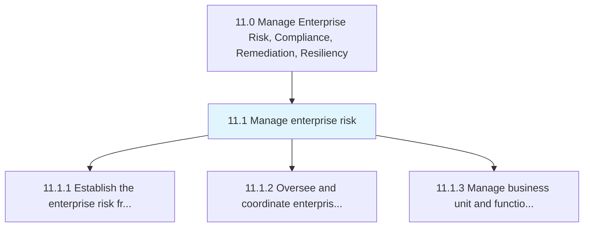
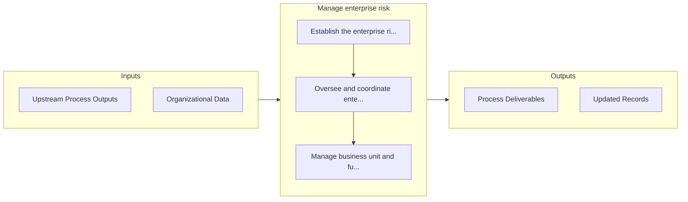

# Manage enterprise risk

> Creating requisite frameworks and coordinating all risk management activities for the entire organization and each function.

## Overview

Group 11.1 is a process group within APQC Category 11.0 (Manage Enterprise Risk, Compliance, Remediation, Resiliency). 

Creating requisite frameworks and coordinating all risk management activities for the entire organization and each function. Manage the enterprise risk by outlining the risk policies and procedures. Monitor and communicate all risk management activities. Encourage correspondence among the business units. Manage the risk of all business units and functions.

## Process Hierarchy



## Key Statistics

| Metric | Value |
|--------|-------|
| APQC Code | 17060 |
| Hierarchy ID | 11.1 |
| Level | Group |
| Parent | [11](../) |
| Sub-Processes | 3 |


## GraphDL Semantic Structure

```
manage.EnterpriseRisk
```

| Component | Value | Description |
|-----------|-------|-------------|
| Verb | `manage` | Primary action |
| Object | `enterprise risk` | Direct object |


## Process Flow



## Sub-Processes

| Process | Hierarchy ID | Description |
|---------|-------------|-------------|
| [Establish the enterprise risk framework and policies](./11.1.1-EstablishEnterpriseRiskFramework/) | 11.1.1 | Creating an agenda for the rules and regulations of enterprise risk that deal with hazardous, financ |
| [Oversee and coordinate enterprise risk management activities](./11.1.2-OverseeCoordinateEnterpriseRisk/) | 11.1.2 | Coordinating to plan, organize, lead, and control the activities of an organization in order to mini |
| [Manage business unit and function risk](./11.1.3-ManageBusinessUnitFunction/) | 11.1.3 | Analyzing the threats a business unit/function faces to prioritize the controls it implements |


## Related Concepts

- EnterpriseRisk


---

*Source: APQC PCF 17060 (11.1) - APQC*
