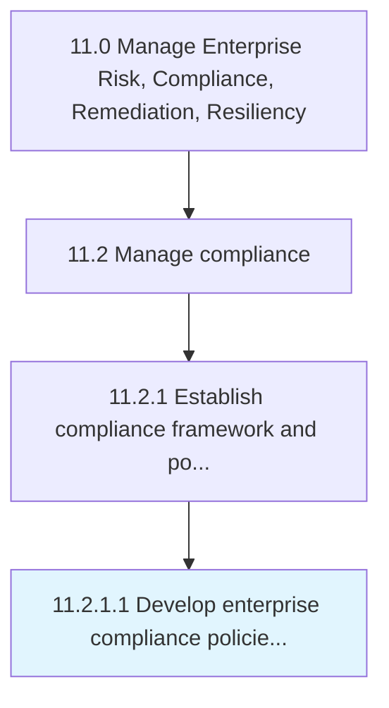

# Develop enterprise compliance policies and procedures

> Creating a standardized approach to ethics and compliance.

## Overview

Activity 11.2.1.1 is an activity within the Manage Enterprise Risk, Compliance, Remediation, Resiliency framework. 

Creating a standardized approach to ethics and compliance. Have a programmatic approach for compliance that focuses on the definite risks the organization faces.

## Process Hierarchy



## Key Statistics

| Metric | Value |
|--------|-------|
| APQC Code | 17469 |
| Hierarchy ID | 11.2.1.1 |
| Level | Activity |
| Parent | [11.2.1](../) |
| Sub-Processes | 0 |


## GraphDL Semantic Structure

```
develop.EnterpriseCompliancePoliciesAndProcedures
```

| Component | Value | Description |
|-----------|-------|-------------|
| Verb | `develop` | Primary action |
| Object | `enterprise compliance policies and procedures` | Direct object |


## Related Concepts

- [EnterpriseCompliancePolicies](/concepts/EnterpriseCompliancePolicies)
- [Procedures](/concepts/Procedures)


---

*Source: APQC PCF 17469 (11.2.1.1) - APQC*
