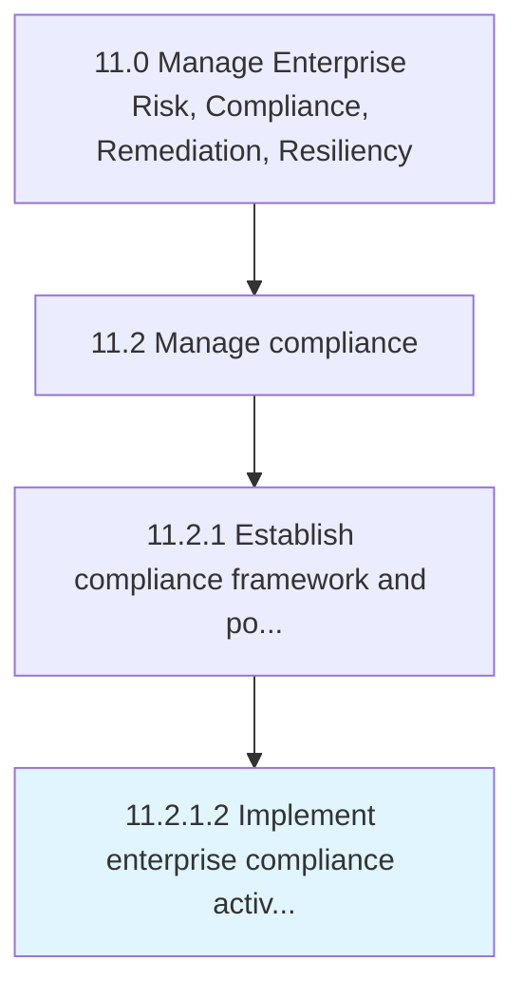

# Implement enterprise compliance activities

> Implementing standardized for ethics and compliance.

## Overview

Activity 11.2.1.2 is an activity within the Manage Enterprise Risk, Compliance, Remediation, Resiliency framework. 

Implementing standardized for ethics and compliance. Have a programmatic approach, built from the top down, to enterprise compliance that focuses on the definite risks the organization faces.

## Process Hierarchy



## Key Statistics

| Metric | Value |
|--------|-------|
| APQC Code | 17470 |
| Hierarchy ID | 11.2.1.2 |
| Level | Activity |
| Parent | [11.2.1](../) |
| Sub-Processes | 0 |


## GraphDL Semantic Structure

```
implement.EnterpriseComplianceActivities
```

| Component | Value | Description |
|-----------|-------|-------------|
| Verb | `implement` | Primary action |
| Object | `enterprise compliance activities` | Direct object |


## Related Concepts

- [EnterpriseComplianceActivities](/concepts/EnterpriseComplianceActivities)


---

*Source: APQC PCF 17470 (11.2.1.2) - APQC*
