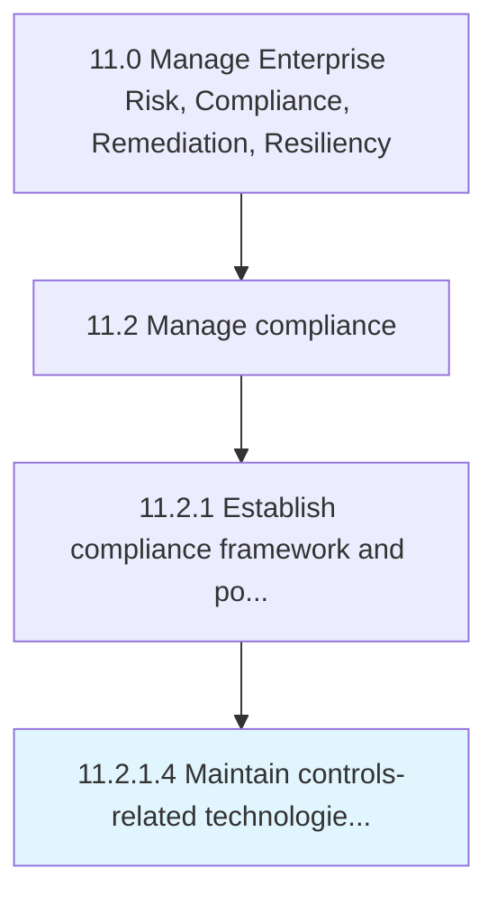

# Maintain controls-related technologies and tools

> Managing technologies and tools related to the confidentiality, integrity, and availability of data in order to ensure the security of the organization's information.

## Overview

Activity 11.2.1.4 is an activity within the Manage Enterprise Risk, Compliance, Remediation, Resiliency framework. 

Managing technologies and tools related to the confidentiality, integrity, and availability of data in order to ensure the security of the organization's information.

## Process Hierarchy



## Key Statistics

| Metric | Value |
|--------|-------|
| APQC Code | 14137 |
| Hierarchy ID | 11.2.1.4 |
| Level | Activity |
| Parent | [11.2.1](../) |
| Sub-Processes | 0 |


## GraphDL Semantic Structure

```
maintain.ControlsrelatedTechnologiesAndTools
```

| Component | Value | Description |
|-----------|-------|-------------|
| Verb | `maintain` | Primary action |
| Object | `controls-related technologies and tools` | Direct object |


---

*Source: APQC PCF 14137 (11.2.1.4) - APQC*
