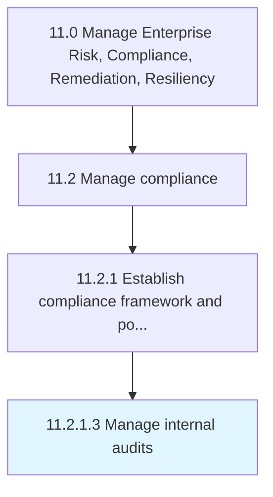

# Manage internal audits

> Managing accounts and prepare regular reports on financial performance.

## Overview

Activity 11.2.1.3 is an activity within the Manage Enterprise Risk, Compliance, Remediation, Resiliency framework. 

Managing accounts and prepare regular reports on financial performance.

## Process Hierarchy



## Key Statistics

| Metric | Value |
|--------|-------|
| APQC Code | 14133 |
| Hierarchy ID | 11.2.1.3 |
| Level | Activity |
| Parent | [11.2.1](../) |
| Sub-Processes | 0 |


## GraphDL Semantic Structure

```
manage.InternalAudits
```

| Component | Value | Description |
|-----------|-------|-------------|
| Verb | `manage` | Primary action |
| Object | `internal audits` | Direct object |


## Related Concepts

- [InternalAudits](/concepts/InternalAudits)


---

*Source: APQC PCF 14133 (11.2.1.3) - APQC*
