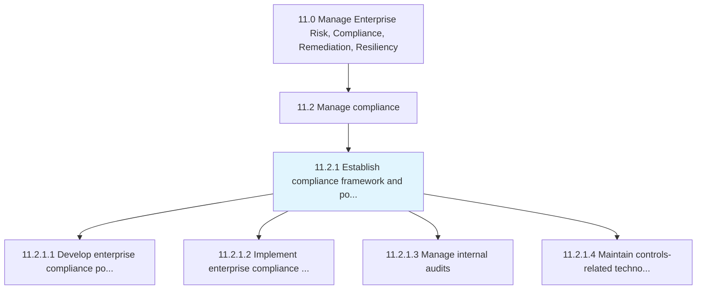
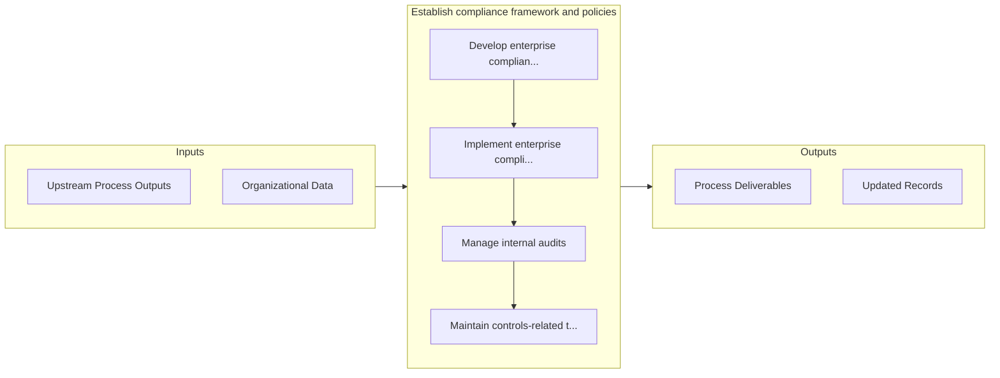

# Establish compliance framework and policies

> Developing a set of procedures detailing an organization's progress in complying with established guidelines, provisions, and legislation.

## Overview

Process 11.2.1 is a core process that defines the specific procedures for establish compliance framework and policies. 

Developing a set of procedures detailing an organization's progress in complying with established guidelines, provisions, and legislation.

## Process Hierarchy



## Key Statistics

| Metric | Value |
|--------|-------|
| APQC Code | 17468 |
| Hierarchy ID | 11.2.1 |
| Level | Process |
| Parent | [11.2](../) |
| Sub-Processes | 4 |


## GraphDL Semantic Structure

```
establish.ComplianceFrameworkAndPolicies
```

| Component | Value | Description |
|-----------|-------|-------------|
| Verb | `establish` | Primary action |
| Object | `compliance framework and policies` | Direct object |


## Process Flow



## Sub-Processes

| Process | Hierarchy ID | Description |
|---------|-------------|-------------|
| [Develop enterprise compliance policies and procedures](./DevelopEnterpriseCompliancePoliciesAndProcedures) | 11.2.1.1 | Creating a standardized approach to ethics and compliance |
| [Implement enterprise compliance activities](./ImplementEnterpriseComplianceActivities) | 11.2.1.2 | Implementing standardized for ethics and compliance |
| [Manage internal audits](./ManageInternalAudits) | 11.2.1.3 | Managing accounts and prepare regular reports on financial performance |
| [Maintain controls-related technologies and tools](./MaintainControlsrelatedTechnologiesAndTools) | 11.2.1.4 | Managing technologies and tools related to the confidentiality, integrity, and availability of data  |


## Related Concepts

- ComplianceFramework
- Policies


---

*Source: APQC PCF 17468 (11.2.1) - APQC*
