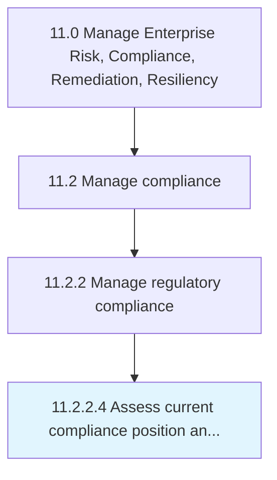

# Assess current compliance position and identify weaknesses or shortfalls therein

> Evaluating current regulatory policies and regulations.

## Overview

Activity 11.2.2.4 is an activity within the Manage Enterprise Risk, Compliance, Remediation, Resiliency framework. 

Evaluating current regulatory policies and regulations. Assess their performance. Make necessary changes.

## Process Hierarchy



## Key Statistics

| Metric | Value |
|--------|-------|
| APQC Code | 16467 |
| Hierarchy ID | 11.2.2.4 |
| Level | Activity |
| Parent | [11.2.2](../) |
| Sub-Processes | 0 |


## GraphDL Semantic Structure

```
assess.CurrentCompliancePositionAndIdentifyWeaknessesOrShortfallsTherein
```

| Component | Value | Description |
|-----------|-------|-------------|
| Verb | `assess` | Primary action |
| Object | `current compliance position and identify weaknesses or shortfalls therein` | Direct object |


## Related Concepts

- [CurrentCompliancePosition](/concepts/CurrentCompliancePosition)
- [IdentifyWeaknessesTherein](/concepts/IdentifyWeaknessesTherein)
- [ShortfallsTherein](/concepts/ShortfallsTherein)


---

*Source: APQC PCF 16467 (11.2.2.4) - APQC*
