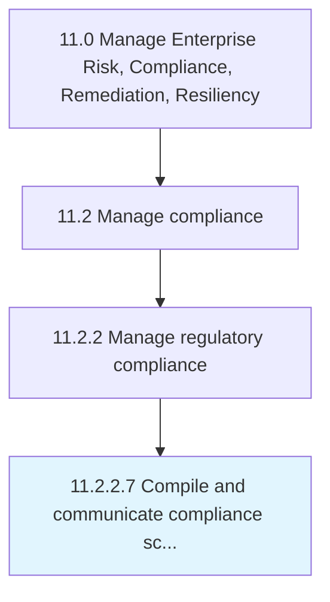

# Compile and communicate compliance scorecard(s)

> Creating a graphical representation of metrics in order to communicate the general health of the organization in relation to risk and compliancy.

## Overview

Activity 11.2.2.7 is an activity within the Manage Enterprise Risk, Compliance, Remediation, Resiliency framework. 

Creating a graphical representation of metrics in order to communicate the general health of the organization in relation to risk and compliancy.

## Process Hierarchy



## Key Statistics

| Metric | Value |
|--------|-------|
| APQC Code | 19595 |
| Hierarchy ID | 11.2.2.7 |
| Level | Activity |
| Parent | [11.2.2](../) |
| Sub-Processes | 0 |


## GraphDL Semantic Structure

```
compile.AndCommunicateComplianceScorecards
```

| Component | Value | Description |
|-----------|-------|-------------|
| Verb | `compile` | Primary action |
| Object | `and communicate compliance scorecard(s)` | Direct object |


## Related Concepts

- [ComplianceScorecard(S](/concepts/ComplianceScorecard(S)
- [ComplianceScorecard(S](/concepts/ComplianceScorecard(S)


---

*Source: APQC PCF 19595 (11.2.2.7) - APQC*
