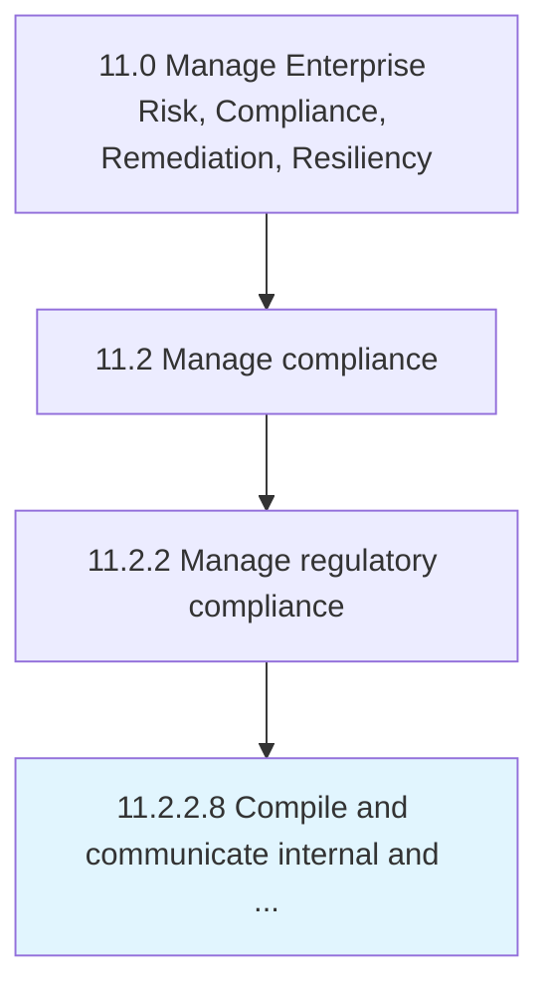

# Compile and communicate internal and regulatory compliance reports

> Submitting compliance reports to regulatory agencies.

## Overview

Activity 11.2.2.8 is an activity within the Manage Enterprise Risk, Compliance, Remediation, Resiliency framework. 

Submitting compliance reports to regulatory agencies. These reports can be made to environmental, securities, or human resources agencies as stipulated by the local governing body.

## Process Hierarchy



## Key Statistics

| Metric | Value |
|--------|-------|
| APQC Code | 19596 |
| Hierarchy ID | 11.2.2.8 |
| Level | Activity |
| Parent | [11.2.2](../) |
| Sub-Processes | 0 |


## GraphDL Semantic Structure

```
compile.AndCommunicateInternalAndRegulatoryComplianceReports
```

| Component | Value | Description |
|-----------|-------|-------------|
| Verb | `compile` | Primary action |
| Object | `and communicate internal and regulatory compliance reports` | Direct object |


## Related Concepts

- [InternalComplianceReports](/concepts/InternalComplianceReports)
- [RegulatoryComplianceReports](/concepts/RegulatoryComplianceReports)
- [InternalComplianceReports](/concepts/InternalComplianceReports)
- [RegulatoryComplianceReports](/concepts/RegulatoryComplianceReports)


---

*Source: APQC PCF 19596 (11.2.2.8) - APQC*
