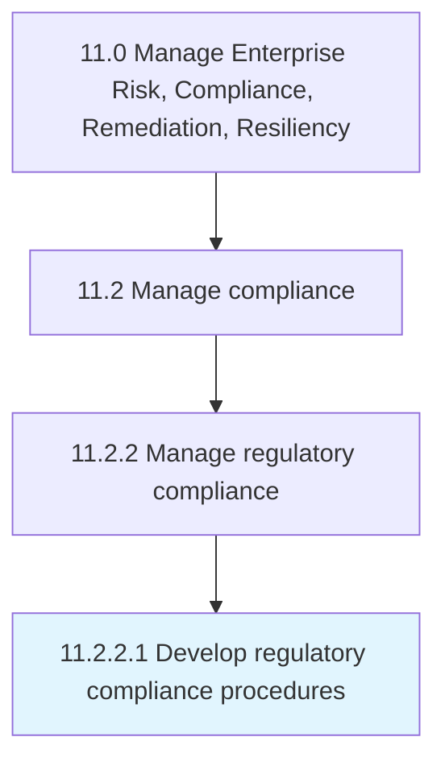

# Develop regulatory compliance procedures

> Developing procedures and methodologies to comply with relevant laws and regulations of an organization's obedience to laws, guidelines, strategies and stipulations related to business.

## Overview

Activity 11.2.2.1 is an activity within the Manage Enterprise Risk, Compliance, Remediation, Resiliency framework. 

Developing procedures and methodologies to comply with relevant laws and regulations of an organization's obedience to laws, guidelines, strategies and stipulations related to business.

## Process Hierarchy



## Key Statistics

| Metric | Value |
|--------|-------|
| APQC Code | 16464 |
| Hierarchy ID | 11.2.2.1 |
| Level | Activity |
| Parent | [11.2.2](../) |
| Sub-Processes | 0 |


## GraphDL Semantic Structure

```
develop.RegulatoryComplianceProcedures
```

| Component | Value | Description |
|-----------|-------|-------------|
| Verb | `develop` | Primary action |
| Object | `regulatory compliance procedures` | Direct object |


## Related Concepts

- [RegulatoryComplianceProcedures](/concepts/RegulatoryComplianceProcedures)


---

*Source: APQC PCF 16464 (11.2.2.1) - APQC*
