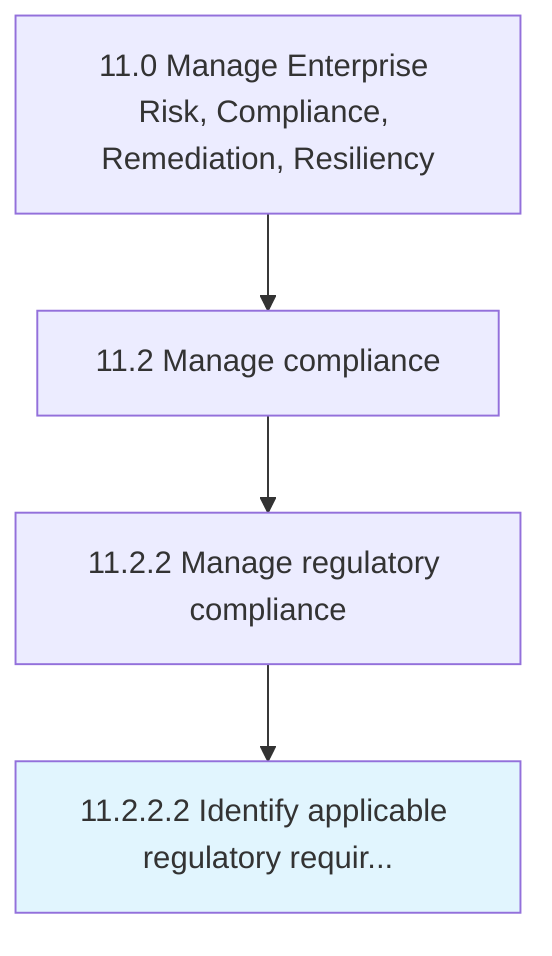

# Identify applicable regulatory requirements

> Determining the regulatory requirements that are most appropriate for the organization.

## Overview

Activity 11.2.2.2 is an activity within the Manage Enterprise Risk, Compliance, Remediation, Resiliency framework. 

Determining the regulatory requirements that are most appropriate for the organization. Identify goals in order to follow the appropriate rules and regulations, guidelines, and strategies.

## Process Hierarchy



## Key Statistics

| Metric | Value |
|--------|-------|
| APQC Code | 16465 |
| Hierarchy ID | 11.2.2.2 |
| Level | Activity |
| Parent | [11.2.2](../) |
| Sub-Processes | 0 |


## GraphDL Semantic Structure

```
identify.ApplicableRegulatoryRequirements
```

| Component | Value | Description |
|-----------|-------|-------------|
| Verb | `identify` | Primary action |
| Object | `applicable regulatory requirements` | Direct object |


## Related Concepts

- ApplicableRegulatoryRequirements


---

*Source: APQC PCF 16465 (11.2.2.2) - APQC*
