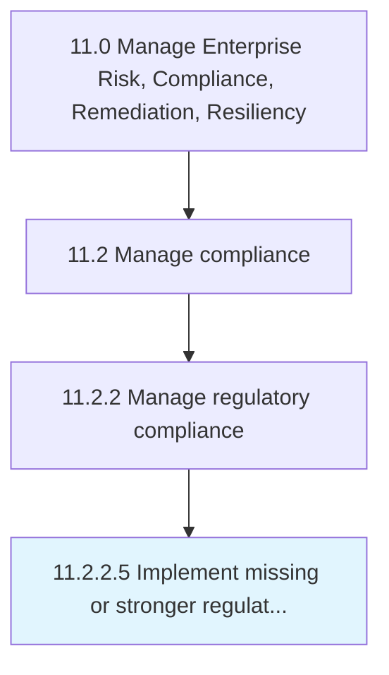

# Implement missing or stronger regulatory compliance controls and policies

> Assessing the current policies and policies.

## Overview

Activity 11.2.2.5 is an activity within the Manage Enterprise Risk, Compliance, Remediation, Resiliency framework. 

Assessing the current policies and policies. Implement missing and necessary changes environmental changes, political changes, technological changes, etc.

## Process Hierarchy



## Key Statistics

| Metric | Value |
|--------|-------|
| APQC Code | 16468 |
| Hierarchy ID | 11.2.2.5 |
| Level | Activity |
| Parent | [11.2.2](../) |
| Sub-Processes | 0 |


## GraphDL Semantic Structure

```
implement.MissingOrStrongerRegulatoryComplianceControlsAndPolicies
```

| Component | Value | Description |
|-----------|-------|-------------|
| Verb | `implement` | Primary action |
| Object | `missing or stronger regulatory compliance controls and policies` | Direct object |


## Related Concepts

- MissingRegulatoryComplianceControls
- Policies
- StrongerRegulatoryComplianceControls
- Policies


---

*Source: APQC PCF 16468 (11.2.2.5) - APQC*
