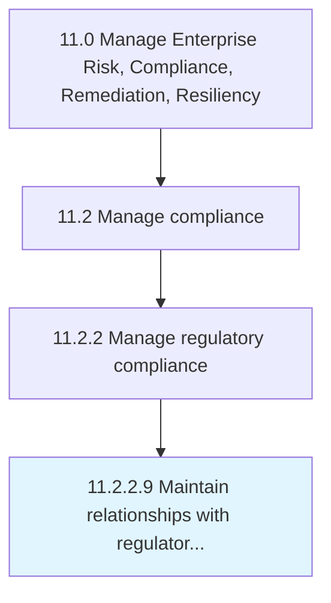

# Maintain relationships with regulators as appropriate

> Developing and preserving relationships with the regulators, without compromising the legal basis of the relationship.

## Overview

Activity 11.2.2.9 is an activity within the Manage Enterprise Risk, Compliance, Remediation, Resiliency framework. 

Developing and preserving relationships with the regulators, without compromising the legal basis of the relationship.

## Process Hierarchy



## Key Statistics

| Metric | Value |
|--------|-------|
| APQC Code | 16470 |
| Hierarchy ID | 11.2.2.9 |
| Level | Activity |
| Parent | [11.2.2](../) |
| Sub-Processes | 0 |


## GraphDL Semantic Structure

```
maintain.Relationships.with.RegulatorsAsAppropriate
```

| Component | Value | Description |
|-----------|-------|-------------|
| Verb | `maintain` | Primary action |
| Object | `relationships` | Direct object |
| Preposition | `with` | Relationship |
| PrepObject | `regulators as appropriate` | Indirect object |


## Related Concepts

- [Relationships](/concepts/Relationships)
- [RegulatorsAsAppropriate](/concepts/RegulatorsAsAppropriate)


---

*Source: APQC PCF 16470 (11.2.2.9) - APQC*
