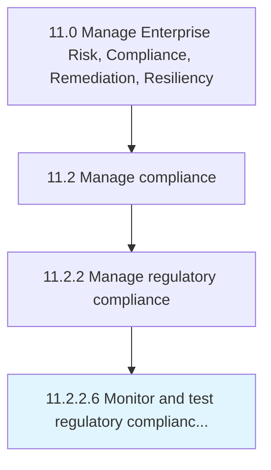

# Monitor and test regulatory compliance position and existing controls

> Monitoring, appraising, and evaluating the compliance position of the organization in order to fine-tune for effective remediation.

## Overview

Activity 11.2.2.6 is an activity within the Manage Enterprise Risk, Compliance, Remediation, Resiliency framework. 

Monitoring, appraising, and evaluating the compliance position of the organization in order to fine-tune for effective remediation. Track efforts for handling regulatory and compliance requirements necessitated by law. Test the robustness of internal frameworks, procedures, and approaches for dealing with these requirements, in order to clearly identify any necessary changes.

## Process Hierarchy



## Key Statistics

| Metric | Value |
|--------|-------|
| APQC Code | 16469 |
| Hierarchy ID | 11.2.2.6 |
| Level | Activity |
| Parent | [11.2.2](../) |
| Sub-Processes | 0 |


## GraphDL Semantic Structure

```
monitor.AndTestRegulatoryCompliancePositionAndExistingControls
```

| Component | Value | Description |
|-----------|-------|-------------|
| Verb | `monitor` | Primary action |
| Object | `and test regulatory compliance position and existing controls` | Direct object |


## Related Concepts

- [RegulatoryCompliancePositionControls](/concepts/RegulatoryCompliancePositionControls)
- [ExistingControls](/concepts/ExistingControls)
- [RegulatoryCompliancePositionControls](/concepts/RegulatoryCompliancePositionControls)
- [ExistingControls](/concepts/ExistingControls)


---

*Source: APQC PCF 16469 (11.2.2.6) - APQC*
