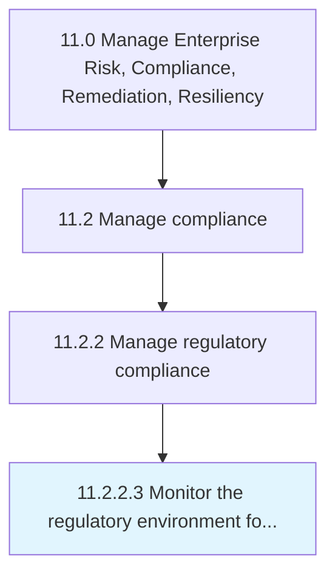

# Monitor the regulatory environment for changing or emerging regulations

> Analyzing and overseeing the regulatory environment in order to spot any changing or emerging regulations.

## Overview

Activity 11.2.2.3 is an activity within the Manage Enterprise Risk, Compliance, Remediation, Resiliency framework. 

Analyzing and overseeing the regulatory environment in order to spot any changing or emerging regulations. This process element calls upon the organization to monitor the regulatory environment for any new statutes, policies, and enactments issued by the respective government authorities or those which have been updated.

## Process Hierarchy



## Key Statistics

| Metric | Value |
|--------|-------|
| APQC Code | 16466 |
| Hierarchy ID | 11.2.2.3 |
| Level | Activity |
| Parent | [11.2.2](../) |
| Sub-Processes | 0 |


## GraphDL Semantic Structure

```
monitor.TheRegulatoryEnvironment.for.ChangingOrEmergingRegulations
```

| Component | Value | Description |
|-----------|-------|-------------|
| Verb | `monitor` | Primary action |
| Object | `the regulatory environment` | Direct object |
| Preposition | `for` | Relationship |
| PrepObject | `changing or emerging regulations` | Indirect object |


## Related Concepts

- RegulatoryEnvironment
- ChangingRegulations
- RegulatoryEnvironment
- EmergingRegulations


---

*Source: APQC PCF 16466 (11.2.2.3) - APQC*
