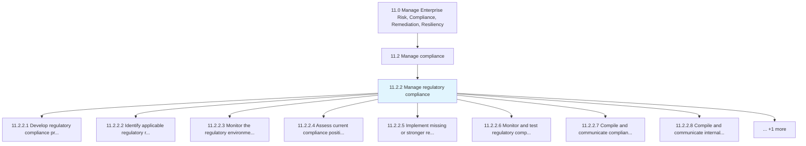
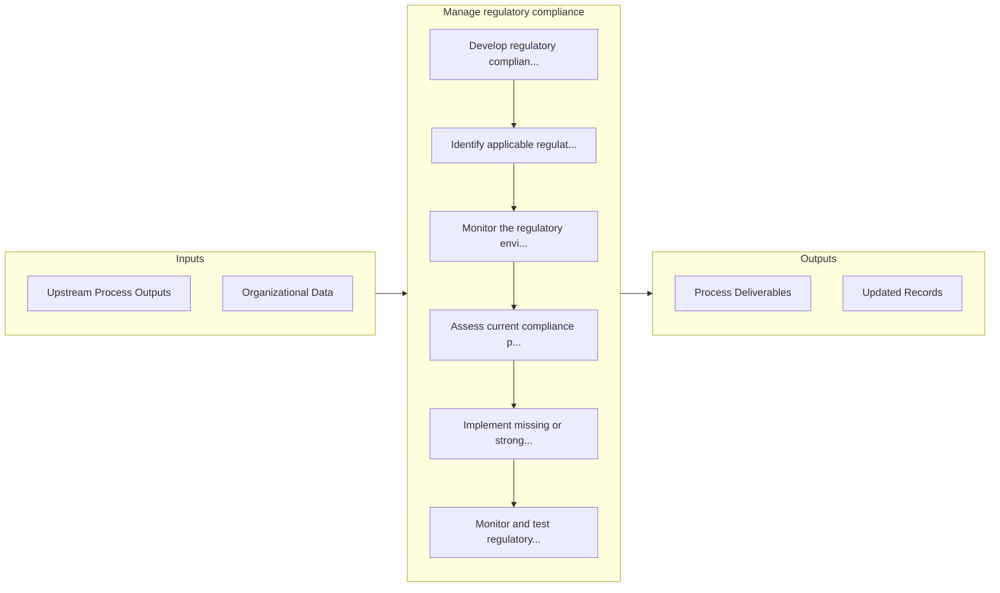

# Manage regulatory compliance

> Obeying laws, guidelines, strategies, and stipulations related to the business.

## Overview

Process 11.2.2 is a core process that defines the specific procedures for manage regulatory compliance. 

Obeying laws, guidelines, strategies, and stipulations related to the business.

## Process Hierarchy



## Key Statistics

| Metric | Value |
|--------|-------|
| APQC Code | 16463 |
| Hierarchy ID | 11.2.2 |
| Level | Process |
| Parent | [11.2](../) |
| Sub-Processes | 9 |


## GraphDL Semantic Structure

```graphdl
manage.RegulatoryCompliance
```

| Component | Value | Description |
|-----------|-------|-------------|
| Verb | `manage` | Primary action |
| Object | `regulatory compliance` | Direct object |


## Process Flow



## Sub-Processes

| Process | Hierarchy ID | Description |
|---------|-------------|-------------|
| [Develop regulatory compliance procedures](./DevelopRegulatoryComplianceProcedures) | 11.2.2.1 | Developing procedures and methodologies to comply with relevant laws and regulations of an organizat |
| [Identify applicable regulatory requirements](./IdentifyApplicableRegulatoryRequirements) | 11.2.2.2 | Determining the regulatory requirements that are most appropriate for the organization |
| [Monitor the regulatory environment for changing or emerging regulations](./MonitorTheRegulatoryEnvironmentForChangingOrEmergingRegulations) | 11.2.2.3 | Analyzing and overseeing the regulatory environment in order to spot any changing or emerging regula |
| [Assess current compliance position and identify weaknesses or shortfalls therein](./AssessCurrentCompliancePositionAndIdentifyWeaknessesOrShortfallsTherein) | 11.2.2.4 | Evaluating current regulatory policies and regulations |
| [Implement missing or stronger regulatory compliance controls and policies](./ImplementMissingOrStrongerRegulatoryComplianceControlsAndPolicies) | 11.2.2.5 | Assessing the current policies and policies |
| [Monitor and test regulatory compliance position and existing controls](./MonitorAndTestRegulatoryCompliancePositionAndExistingControls) | 11.2.2.6 | Monitoring, appraising, and evaluating the compliance position of the organization in order to fine- |
| [Compile and communicate compliance scorecard(s)](./CompileAndCommunicateComplianceScorecards) | 11.2.2.7 | Creating a graphical representation of metrics in order to communicate the general health of the org |
| [Compile and communicate internal and regulatory compliance reports](./CompileAndCommunicateInternalAndRegulatoryComplianceReports) | 11.2.2.8 | Submitting compliance reports to regulatory agencies |
| [Maintain relationships with regulators as appropriate](./MaintainRelationshipsWithRegulatorsAsAppropriate) | 11.2.2.9 | Developing and preserving relationships with the regulators, without compromising the legal basis of |


## Related Concepts

- RegulatoryCompliance


---

*Source: APQC PCF 16463 (11.2.2) - APQC*
