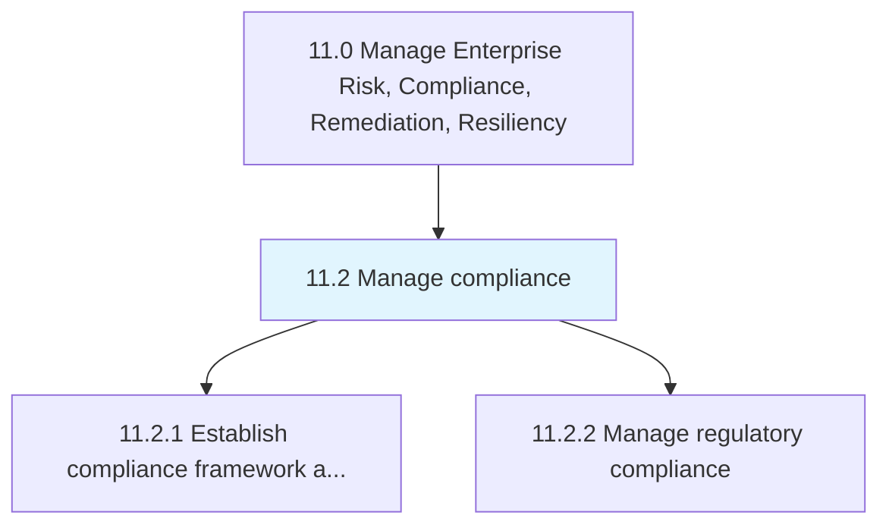
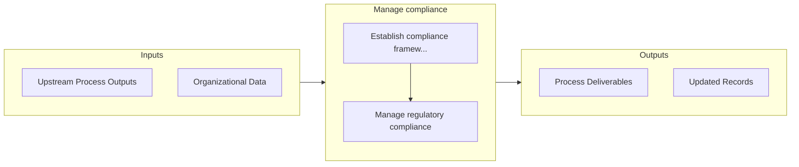

# Manage compliance

> Managing steps to confirm enduring compliance to industry regulations and government legislation.

## Overview

Group 11.2 is a process group within APQC Category 11.0 (Manage Enterprise Risk, Compliance, Remediation, Resiliency). 

Managing steps to confirm enduring compliance to industry regulations and government legislation.

## Process Hierarchy



## Key Statistics

| Metric | Value |
|--------|-------|
| APQC Code | 17467 |
| Hierarchy ID | 11.2 |
| Level | Group |
| Parent | [11](../) |
| Sub-Processes | 2 |


## GraphDL Semantic Structure

```
manage.Compliance
```

| Component | Value | Description |
|-----------|-------|-------------|
| Verb | `manage` | Primary action |
| Object | `compliance` | Direct object |


## Process Flow



## Sub-Processes

| Process | Hierarchy ID | Description |
|---------|-------------|-------------|
| [Establish compliance framework and policies](./11.2.1-EstablishComplianceFrameworkPolicies/) | 11.2.1 | Developing a set of procedures detailing an organization's progress in complying with established gu |
| [Manage regulatory compliance](./11.2.2-ManageRegulatoryCompliance/) | 11.2.2 | Obeying laws, guidelines, strategies, and stipulations related to the business |


## Related Concepts

- [Compliance](/concepts/Compliance)


---

*Source: APQC PCF 17467 (11.2) - APQC*
