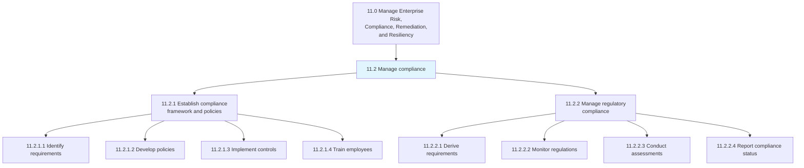
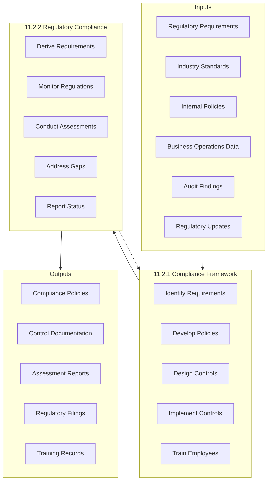
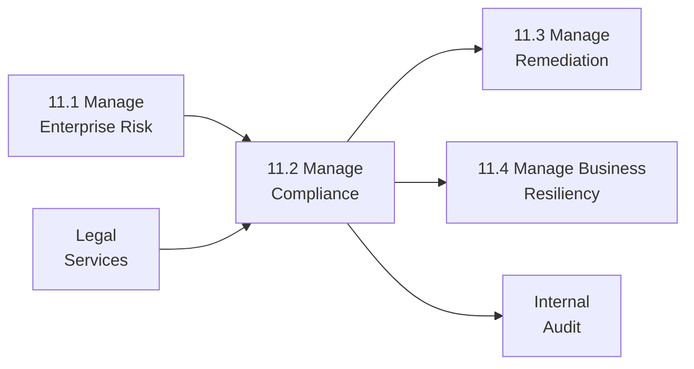

# Manage compliance

> Managing steps to confirm enduring compliance to industry regulations and government legislation. This process group establishes compliance frameworks, monitors regulatory requirements, and ensures organizational adherence to all applicable laws and standards.

## Overview

Process Group 11.2 encompasses all activities required to establish and maintain organizational compliance with external regulations, industry standards, and internal policies. This includes developing compliance frameworks, implementing monitoring systems, managing regulatory relationships, and responding to compliance gaps.

Effective compliance management protects organizations from legal penalties, reputational damage, and operational disruptions while enabling confident business operations. Modern compliance functions balance regulatory requirements with operational efficiency, leveraging technology and risk-based approaches to prioritize compliance activities.

## Process Hierarchy



## Key Statistics

| Metric | Value |
|--------|-------|
| APQC Code | 17467 |
| Hierarchy ID | 11.2 |
| Level | Process Group |
| Category | [11.0 Manage Enterprise Risk, Compliance, Remediation, Resiliency](../) |
| Child Processes | 2 |
| Total Activities | 13 |

## Process Flow



## GraphDL Semantic Structure

```graphdl
manage.Compliance
```

| Component | Value | Description |
|-----------|-------|-------------|
| Verb | `manage` | Overseeing and controlling action |
| Object | `Compliance` | Regulatory and policy adherence |

### Decomposed Actions

| Process | GraphDL Structure |
|---------|-------------------|
| 11.2.1 | `establish.ComplianceFramework.and.Policies` |
| 11.2.2 | `manage.RegulatoryCompliance` |

## Child Processes

### [11.2.1 Establish compliance framework and policies](./11.2.1-EstablishComplianceFrameworkPolicies/)

Developing a set of procedures detailing an organization's progress in complying with established guidelines, specifications, and legislation. This includes identifying requirements, creating policies, implementing controls, and training employees.

**APQC Code:** 17468 | **Activities:** 5

Key activities include identifying compliance requirements, developing compliance policies and procedures, designing and implementing internal controls, training employees on compliance requirements, and documenting the compliance framework.

### [11.2.2 Manage regulatory compliance](./11.2.2-ManageRegulatoryCompliance/)

Obeying laws, guidelines, strategies, and stipulations related to the business. This includes monitoring regulatory changes, conducting compliance assessments, and maintaining regulatory relationships.

**APQC Code:** 17474 | **Activities:** 8

Key activities include deriving regulatory compliance requirements, monitoring regulatory changes, conducting compliance assessments, identifying and addressing compliance gaps, filing required regulatory reports, managing regulatory relationships, responding to regulatory inquiries, and tracking compliance status.

## RACI Matrix

| Process | Responsible | Accountable | Consulted | Informed |
|---------|-------------|-------------|-----------|----------|
| 11.2.1 Establish Framework | Compliance Team | Chief Compliance Officer | Legal, BU Leaders | Board, All Functions |
| 11.2.2 Regulatory Compliance | Compliance Team | Chief Compliance Officer | Legal, Operations | Executive Team, Board |

## Key Stakeholders

| Stakeholder | Role | Responsibilities |
|-------------|------|------------------|
| Board of Directors | Governance | Compliance oversight, policy approval |
| Chief Compliance Officer | Executive Owner | Compliance program leadership |
| General Counsel | Legal Lead | Legal interpretation, regulatory liaison |
| Internal Audit | Assurance | Independent compliance testing |
| Business Unit Leaders | Operational | Day-to-day compliance execution |
| Regulatory Affairs | External Relations | Regulatory engagement |
| Human Resources | Training | Compliance training programs |

## Metrics and KPIs

| Metric | Description | Target |
|--------|-------------|--------|
| Compliance Rate | Percentage of requirements met | >98% |
| Regulatory Findings | External audit findings per year | Zero critical |
| Training Completion | Employees completing compliance training | 100% |
| Policy Coverage | Regulations with documented policies | 100% |
| Issue Resolution Time | Average time to remediate findings | <30 days |
| Regulatory Filings | On-time filing rate | 100% |
| Assessment Completion | Scheduled assessments completed | 100% |
| Control Effectiveness | Controls operating as designed | >95% |

## Compliance Domains

### Regulatory Compliance
Adherence to laws and regulations imposed by government and regulatory bodies. Varies by industry and jurisdiction.

### Industry Standards
Compliance with industry-specific standards and best practices (ISO, SOC, PCI-DSS, etc.).

### Contractual Compliance
Meeting obligations specified in contracts with customers, vendors, and partners.

### Internal Policy Compliance
Adherence to organization's own policies, procedures, and codes of conduct.

### Data Privacy Compliance
Meeting data protection requirements (GDPR, CCPA, HIPAA) for personal and sensitive data.

## Industry Variations

### Banking and Financial Services
Extensive regulatory requirements including Basel, Dodd-Frank, AML/KYC, and consumer protection. Dedicated compliance functions with specialized expertise.

### Healthcare
HIPAA privacy and security requirements, FDA regulations for medical devices/pharmaceuticals, clinical compliance, and billing compliance.

### Manufacturing
Environmental regulations (EPA, OSHA), product safety standards, quality certifications, and export controls.

### Technology
Data privacy regulations, cybersecurity requirements, export controls, and platform-specific regulations.

### Utilities
NERC CIP requirements, environmental regulations, rate compliance, and safety standards.

## Related Processes



## Related Departments

- [Legal](/departments/Legal) - Legal interpretation and regulatory liaison
- [Finance](/departments/Finance) - Financial compliance and reporting
- [Human Resources](/departments/HumanResources) - Employment law compliance
- [Information Technology](/departments/Technology) - Data privacy and cybersecurity
- [Operations](/departments/Operations) - Operational compliance
- [Internal Audit](/departments/Finance/InternalAudit) - Compliance assurance

## Related Occupations

- [Compliance Officers](/occupations/Business/Operations/ComplianceOfficers) - Compliance program management
- [Regulatory Affairs Managers](/occupations/Business/Operations/RegulatoryAffairsManagers) - Regulatory engagement
- [Lawyers](/occupations/Legal/Lawyers) - Legal interpretation
- [Internal Auditors](/occupations/Business/Financial/Auditors) - Compliance testing
- [Risk Managers](/occupations/Business/Operations/RiskManagers) - Risk-based compliance
- [Privacy Officers](/occupations/Business/Operations/ComplianceOfficers) - Data privacy compliance

## Common Regulatory Frameworks

| Framework | Domain | Description |
|-----------|--------|-------------|
| SOX | Financial Reporting | Internal controls over financial reporting |
| GDPR | Data Privacy | EU personal data protection |
| HIPAA | Healthcare | Health information privacy and security |
| PCI-DSS | Payment Card | Credit card data security |
| SOC 2 | Service Organizations | Security, availability, integrity controls |
| ISO 27001 | Information Security | Information security management |
| Basel III | Banking | Capital and liquidity requirements |

## Related Concepts

- ComplianceFramework
- RegulatoryCompliance
- InternalControls
- ComplianceMonitoring
- RegulatoryReporting
- PolicyManagement
- ComplianceTraining

---

*Source: APQC PCF 17467 (11.2) - Cross-Industry Process Classification Framework*
