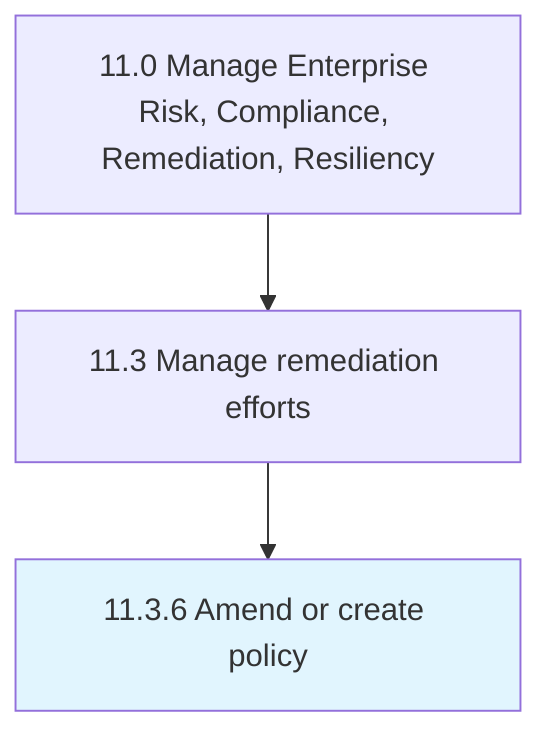

# Amend or create policy

> Crafting a new framework of policies and procedures for deploying remediation efforts, or change existing policies and procedures.

## Overview

Process 11.3.6 is a core process that defines the specific procedures for amend or create policy. 

Crafting a new framework of policies and procedures for deploying remediation efforts, or change existing policies and procedures. Adapt the policy structure to the context of the apposite national and international regulatory frameworks.

## Process Hierarchy



## Key Statistics

| Metric | Value |
|--------|-------|
| APQC Code | 11206 |
| Hierarchy ID | 11.3.6 |
| Level | Process |
| Parent | [11.3](../) |
| Sub-Processes | 0 |


## GraphDL Semantic Structure

```
amend.OrCreatePolicy
```

| Component | Value | Description |
|-----------|-------|-------------|
| Verb | `amend` | Primary action |
| Object | `or create policy` | Direct object |


## Related Concepts

- Policy
- Policy


---

*Source: APQC PCF 11206 (11.3.6) - APQC*
