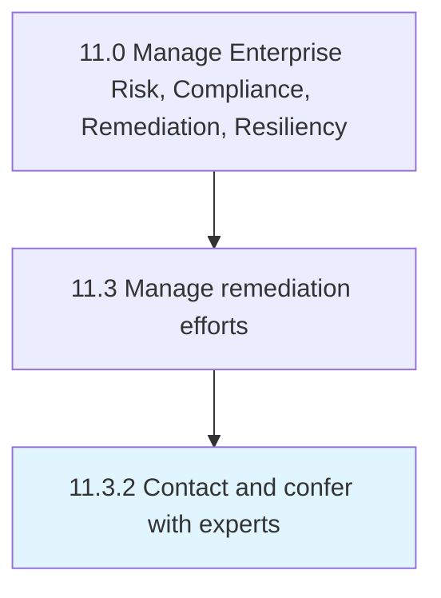

# Contact and confer with experts

> Discussing and soliciting advice from experts for in order to incorporate their suggestion (regarding Create remediation plans [11201]).

## Overview

Process 11.3.2 is a core process that defines the specific procedures for contact and confer with experts. 

Discussing and soliciting advice from experts for in order to incorporate their suggestion (regarding Create remediation plans [11201]).

## Process Hierarchy



## Key Statistics

| Metric | Value |
|--------|-------|
| APQC Code | 11202 |
| Hierarchy ID | 11.3.2 |
| Level | Process |
| Parent | [11.3](../) |
| Sub-Processes | 0 |


## GraphDL Semantic Structure

```
contact.AndConfer.with.Experts
```

| Component | Value | Description |
|-----------|-------|-------------|
| Verb | `contact` | Primary action |
| Object | `and confer` | Direct object |
| Preposition | `with` | Relationship |
| PrepObject | `experts` | Indirect object |


## Related Concepts

- [Experts](/concepts/Experts)
- [Experts](/concepts/Experts)


---

*Source: APQC PCF 11202 (11.3.2) - APQC*
