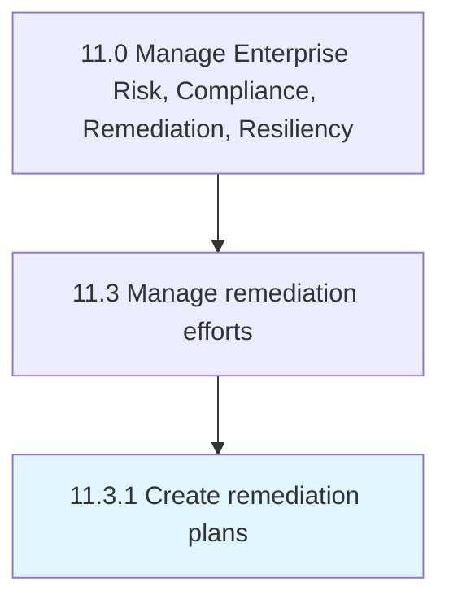

# Create remediation plans

> Creating plans for remediation efforts.

## Overview

Process 11.3.1 is a core process that defines the specific procedures for create remediation plans. 

Creating plans for remediation efforts. Make a plan to address a case of environmental adulteration. Identify and treat the adulteration so that the area will become operational again.

## Process Hierarchy



## Key Statistics

| Metric | Value |
|--------|-------|
| APQC Code | 11201 |
| Hierarchy ID | 11.3.1 |
| Level | Process |
| Parent | [11.3](../) |
| Sub-Processes | 0 |


## GraphDL Semantic Structure

```
create.RemediationPlans
```

| Component | Value | Description |
|-----------|-------|-------------|
| Verb | `create` | Primary action |
| Object | `remediation plans` | Direct object |


## Related Concepts

- [RemediationPlans](/concepts/RemediationPlans)


---

*Source: APQC PCF 11201 (11.3.1) - APQC*
