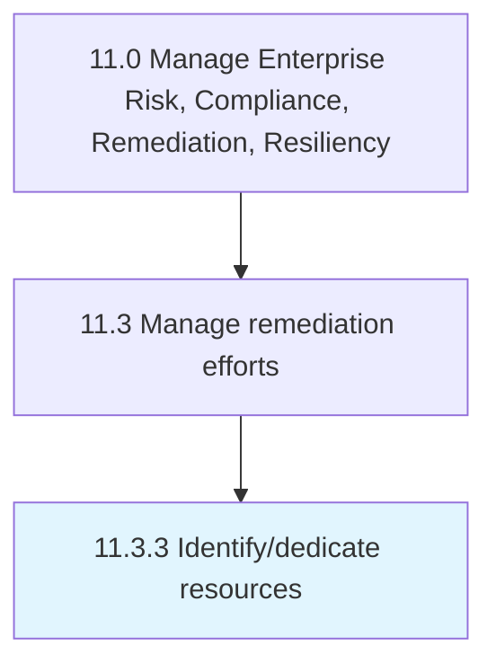

# Identify/dedicate resources

> Identifying and dedicating the resources for managing remediation efforts.

## Overview

Process 11.3.3 is a core process that defines the specific procedures for identify/dedicate resources. 

Identifying and dedicating the resources for managing remediation efforts. Discern the resources needed for remediation efforts. Dispense with resources in a sound and well-reasoned manner.

## Process Hierarchy



## Key Statistics

| Metric | Value |
|--------|-------|
| APQC Code | 11203 |
| Hierarchy ID | 11.3.3 |
| Level | Process |
| Parent | [11.3](../) |
| Sub-Processes | 0 |


## GraphDL Semantic Structure

```
identify/dedicate.Resources
```

| Component | Value | Description |
|-----------|-------|-------------|
| Verb | `identify/dedicate` | Primary action |
| Object | `resources` | Direct object |


## Related Concepts

- /DedicateResources


---

*Source: APQC PCF 11203 (11.3.3) - APQC*
