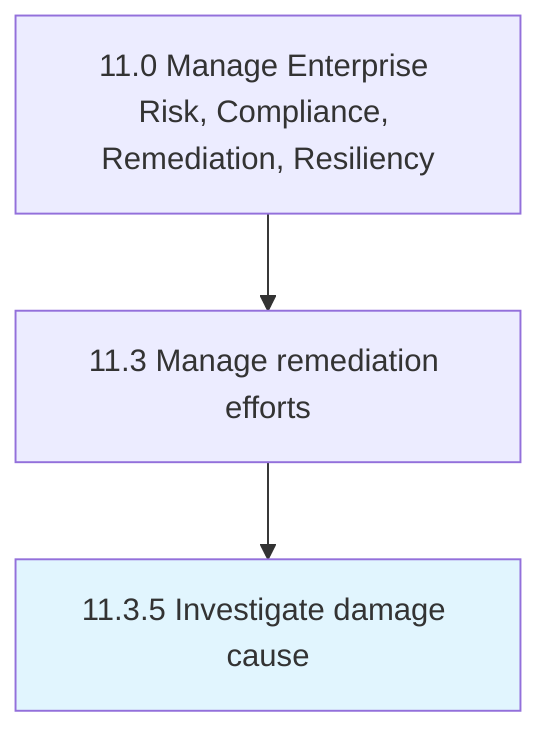

# Investigate damage cause

> Studying the causes of damage, which could be environmental, physical, social, etc.

## Overview

Process 11.3.5 is a core process that defines the specific procedures for investigate damage cause. 

Studying the causes of damage, which could be environmental, physical, social, etc. at country level in order to institute better policies and regulations.

## Process Hierarchy



## Key Statistics

| Metric | Value |
|--------|-------|
| APQC Code | 11205 |
| Hierarchy ID | 11.3.5 |
| Level | Process |
| Parent | [11.3](../) |
| Sub-Processes | 0 |


## GraphDL Semantic Structure

```
investigate.DamageCause
```

| Component | Value | Description |
|-----------|-------|-------------|
| Verb | `investigate` | Primary action |
| Object | `damage cause` | Direct object |


## Related Concepts

- [DamageCause](/concepts/DamageCause)


---

*Source: APQC PCF 11205 (11.3.5) - APQC*
