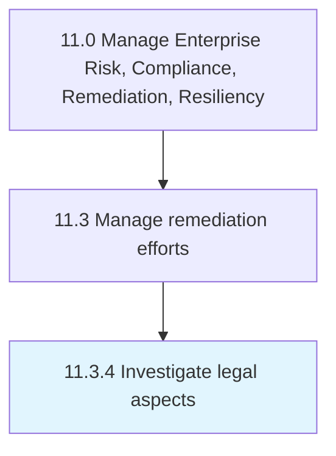

# Investigate legal aspects

> Examining regulatory and legislative frameworks.

## Overview

Process 11.3.4 is a core process that defines the specific procedures for investigate legal aspects. 

Examining regulatory and legislative frameworks. Obligate the organization to remediate any damages through compensations, fines, and any other remedial efforts necessitated to correct the situations. Analyze local environmental laws, binding international covenants, etc. in order to examine legal accuracy about the rules and procedures.

## Process Hierarchy



## Key Statistics

| Metric | Value |
|--------|-------|
| APQC Code | 11204 |
| Hierarchy ID | 11.3.4 |
| Level | Process |
| Parent | [11.3](../) |
| Sub-Processes | 0 |


## GraphDL Semantic Structure

```
investigate.LegalAspects
```

| Component | Value | Description |
|-----------|-------|-------------|
| Verb | `investigate` | Primary action |
| Object | `legal aspects` | Direct object |


## Related Concepts

- [LegalAspects](/concepts/LegalAspects)


---

*Source: APQC PCF 11204 (11.3.4) - APQC*
