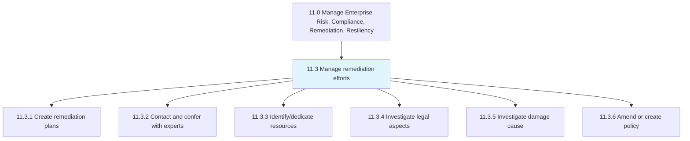
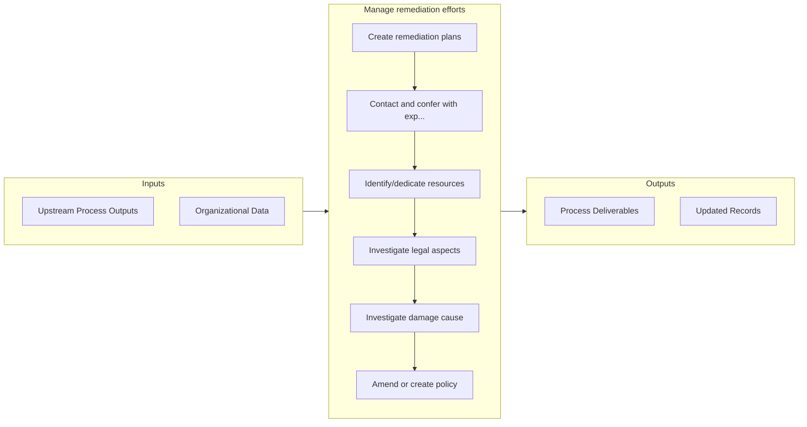

# Manage remediation efforts

> Administering the efforts and activities for remediation.

## Overview

Group 11.3 is a process group within APQC Category 11.0 (Manage Enterprise Risk, Compliance, Remediation, Resiliency). 

Administering the efforts and activities for remediation. This process element requires the organization to create plans for corrective action in collaboration with government agencies and pertinent professional services agencies which specialize in remediation efforts relevant to the organization's operations. Additionally, the organization needs to consult experts to validate the plan, determine resources allocation, resolve any legal concerns, and formulate a company-wide policy for remediation.

## Process Hierarchy



## Key Statistics

| Metric | Value |
|--------|-------|
| APQC Code | 11185 |
| Hierarchy ID | 11.3 |
| Level | Group |
| Parent | [11](../) |
| Sub-Processes | 6 |


## GraphDL Semantic Structure

```
manage.RemediationEfforts
```

| Component | Value | Description |
|-----------|-------|-------------|
| Verb | `manage` | Primary action |
| Object | `remediation efforts` | Direct object |


## Process Flow



## Sub-Processes

| Process | Hierarchy ID | Description |
|---------|-------------|-------------|
| [Create remediation plans](./CreateRemediationPlans) | 11.3.1 | Creating plans for remediation efforts |
| [Contact and confer with experts](./ContactAndConferWithExperts) | 11.3.2 | Discussing and soliciting advice from experts for in order to incorporate their suggestion (regardin |
| [Identify/dedicate resources](./IdentifydedicateResources) | 11.3.3 | Identifying and dedicating the resources for managing remediation efforts |
| [Investigate legal aspects](./InvestigateLegalAspects) | 11.3.4 | Examining regulatory and legislative frameworks |
| [Investigate damage cause](./InvestigateDamageCause) | 11.3.5 | Studying the causes of damage, which could be environmental, physical, social, etc |
| [Amend or create policy](./AmendOrCreatePolicy) | 11.3.6 | Crafting a new framework of policies and procedures for deploying remediation efforts, or change exi |


## Related Concepts

- RemediationEfforts


---

*Source: APQC PCF 11185 (11.3) - APQC*
