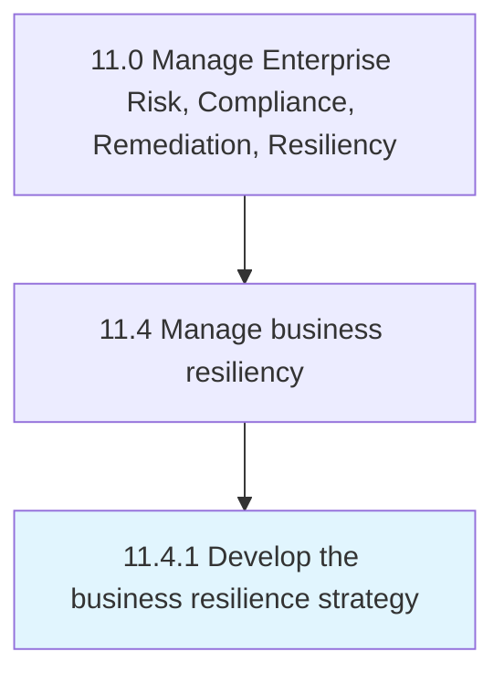

# Develop the business resilience strategy

> Creating a strategy for rapidly adapting to disturbances.

## Overview

Process 11.4.1 is a core process that defines the specific procedures for develop the business resilience strategy. 

Creating a strategy for rapidly adapting to disturbances. Maintain continuous business processes and protecting employees, assets, and overall brand equity.

## Process Hierarchy



## Key Statistics

| Metric | Value |
|--------|-------|
| APQC Code | 11221 |
| Hierarchy ID | 11.4.1 |
| Level | Process |
| Parent | [11.4](../) |
| Sub-Processes | 0 |


## GraphDL Semantic Structure

```
develop.TheBusinessResilienceStrategy
```

| Component | Value | Description |
|-----------|-------|-------------|
| Verb | `develop` | Primary action |
| Object | `the business resilience strategy` | Direct object |


## Related Concepts

- [BusinessResilienceStrategy](/concepts/BusinessResilienceStrategy)


---

*Source: APQC PCF 11221 (11.4.1) - APQC*
