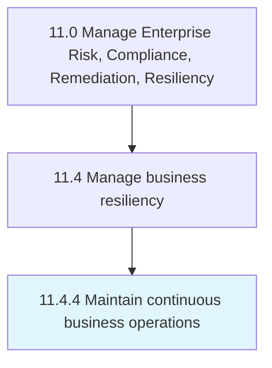

# Maintain continuous business operations

> Evaluating business operations.

## Overview

Process 11.4.4 is a core process that defines the specific procedures for maintain continuous business operations. 

Evaluating business operations. Determine which activities generate revenues, perform best, and provide good returns.

## Process Hierarchy



## Key Statistics

| Metric | Value |
|--------|-------|
| APQC Code | 11224 |
| Hierarchy ID | 11.4.4 |
| Level | Process |
| Parent | [11.4](../) |
| Sub-Processes | 0 |


## GraphDL Semantic Structure

```
maintain.ContinuousBusinessOperations
```

| Component | Value | Description |
|-----------|-------|-------------|
| Verb | `maintain` | Primary action |
| Object | `continuous business operations` | Direct object |


## Related Concepts

- [ContinuousBusinessOperations](/concepts/ContinuousBusinessOperations)


---

*Source: APQC PCF 11224 (11.4.4) - APQC*
