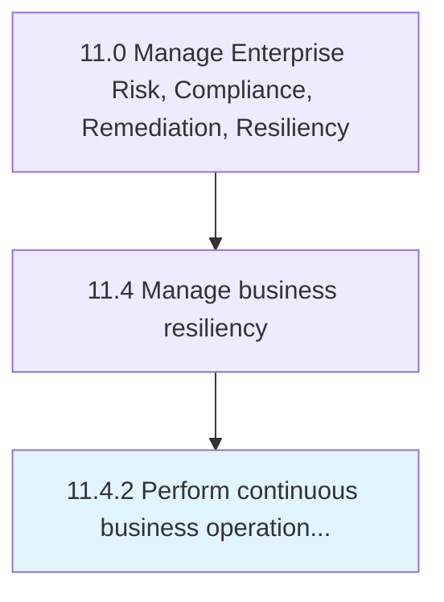

# Perform continuous business operations planning

> Developing plans to ensure continuous business operations.

## Overview

Process 11.4.2 is a core process that defines the specific procedures for perform continuous business operations planning. 

Developing plans to ensure continuous business operations.

## Process Hierarchy



## Key Statistics

| Metric | Value |
|--------|-------|
| APQC Code | 11222 |
| Hierarchy ID | 11.4.2 |
| Level | Process |
| Parent | [11.4](../) |
| Sub-Processes | 0 |


## GraphDL Semantic Structure

```
perform.ContinuousBusinessOperationsPlanning
```

| Component | Value | Description |
|-----------|-------|-------------|
| Verb | `perform` | Primary action |
| Object | `continuous business operations planning` | Direct object |


## Related Concepts

- ContinuousBusinessOperationsPlanning


---

*Source: APQC PCF 11222 (11.4.2) - APQC*
