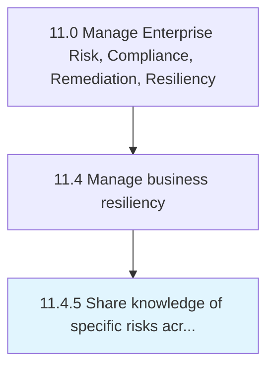

# Share knowledge of specific risks across other parts of the organization

> Sharing information about risks and resilience strategies of business operations across the organization so that prospective risks can be avoided.

## Overview

Process 11.4.5 is a core process that defines the specific procedures for share knowledge of specific risks across other parts of the organization. 

Sharing information about risks and resilience strategies of business operations across the organization so that prospective risks can be avoided.

## Process Hierarchy



## Key Statistics

| Metric | Value |
|--------|-------|
| APQC Code | 16471 |
| Hierarchy ID | 11.4.5 |
| Level | Process |
| Parent | [11.4](../) |
| Sub-Processes | 0 |


## GraphDL Semantic Structure

```
share.Knowledge.of.SpecificRisksAcrossOtherPartsOfTheOrganization
```

| Component | Value | Description |
|-----------|-------|-------------|
| Verb | `share` | Primary action |
| Object | `knowledge` | Direct object |
| Preposition | `of` | Relationship |
| PrepObject | `specific risks across other parts of the organization` | Indirect object |


## Related Concepts

- [Knowledge](/concepts/Knowledge)
- [SpecificRisksAcrossOtherPartsOfOrganization](/concepts/SpecificRisksAcrossOtherPartsOfOrganization)


---

*Source: APQC PCF 16471 (11.4.5) - APQC*
