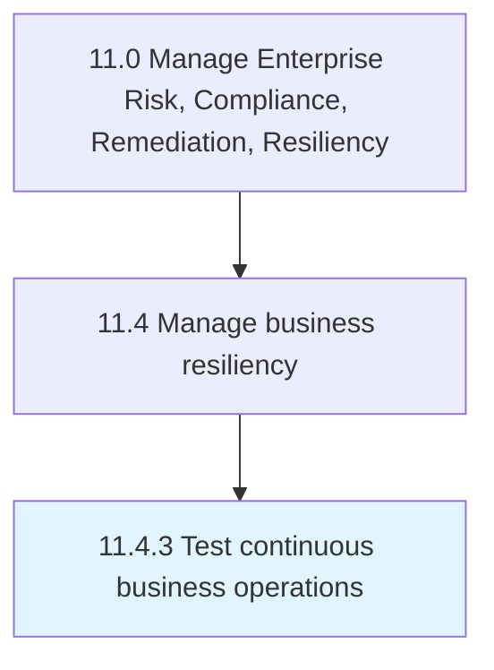

# Test continuous business operations

> Assessing ongoing activities within the organization that are not intended to stop except for in an emergency.

## Overview

Process 11.4.3 is a core process that defines the specific procedures for test continuous business operations. 

Assessing ongoing activities within the organization that are not intended to stop except for in an emergency.

## Process Hierarchy



## Key Statistics

| Metric | Value |
|--------|-------|
| APQC Code | 11223 |
| Hierarchy ID | 11.4.3 |
| Level | Process |
| Parent | [11.4](../) |
| Sub-Processes | 0 |


## GraphDL Semantic Structure

```
test.ContinuousBusinessOperations
```

| Component | Value | Description |
|-----------|-------|-------------|
| Verb | `test` | Primary action |
| Object | `continuous business operations` | Direct object |


## Related Concepts

- ContinuousBusinessOperations


---

*Source: APQC PCF 11223 (11.4.3) - APQC*
