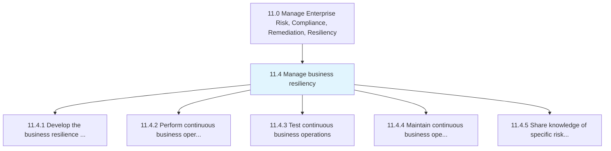
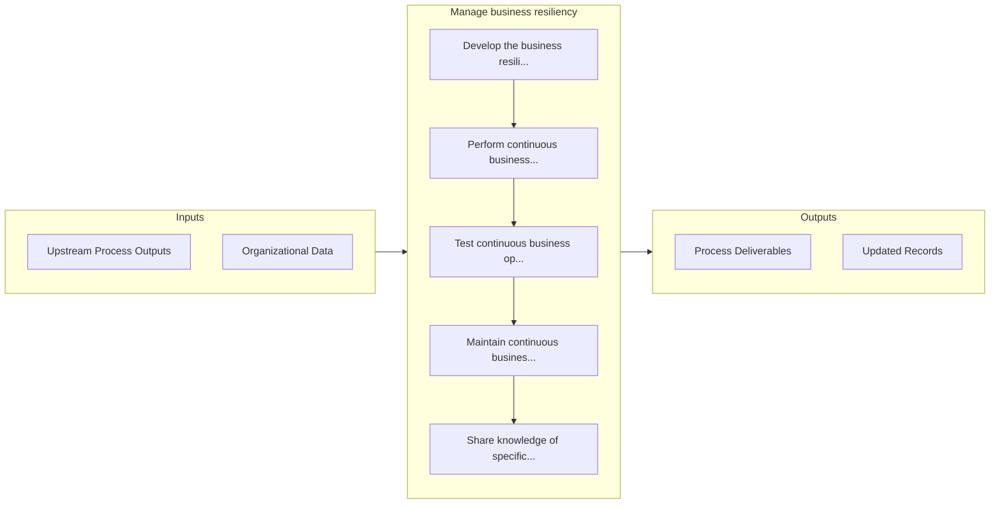

# Manage business resiliency

> Including the processes required to rapidly adapt and respond to any internal or external opportunity, demand, disruption, or threat.

## Overview

Group 11.4 is a process group within APQC Category 11.0 (Manage Enterprise Risk, Compliance, Remediation, Resiliency). 

Including the processes required to rapidly adapt and respond to any internal or external opportunity, demand, disruption, or threat. Develop a more dynamic, strategic, and integrated approach to managing compliance obligations.

## Process Hierarchy



## Key Statistics

| Metric | Value |
|--------|-------|
| APQC Code | 11216 |
| Hierarchy ID | 11.4 |
| Level | Group |
| Parent | [11](../) |
| Sub-Processes | 5 |


## GraphDL Semantic Structure

```
manage.BusinessResiliency
```

| Component | Value | Description |
|-----------|-------|-------------|
| Verb | `manage` | Primary action |
| Object | `business resiliency` | Direct object |


## Process Flow



## Sub-Processes

| Process | Hierarchy ID | Description |
|---------|-------------|-------------|
| [Develop the business resilience strategy](./DevelopTheBusinessResilienceStrategy) | 11.4.1 | Creating a strategy for rapidly adapting to disturbances |
| [Perform continuous business operations planning](./PerformContinuousBusinessOperationsPlanning) | 11.4.2 | Developing plans to ensure continuous business operations |
| [Test continuous business operations](./TestContinuousBusinessOperations) | 11.4.3 | Assessing ongoing activities within the organization that are not intended to stop except for in an  |
| [Maintain continuous business operations](./MaintainContinuousBusinessOperations) | 11.4.4 | Evaluating business operations |
| [Share knowledge of specific risks across other parts of the organization](./ShareKnowledgeOfSpecificRisksAcrossOtherPartsOfTheOrganization) | 11.4.5 | Sharing information about risks and resilience strategies of business operations across the organiza |


## Related Concepts

- [BusinessResiliency](/concepts/BusinessResiliency)


---

*Source: APQC PCF 11216 (11.4) - APQC*
