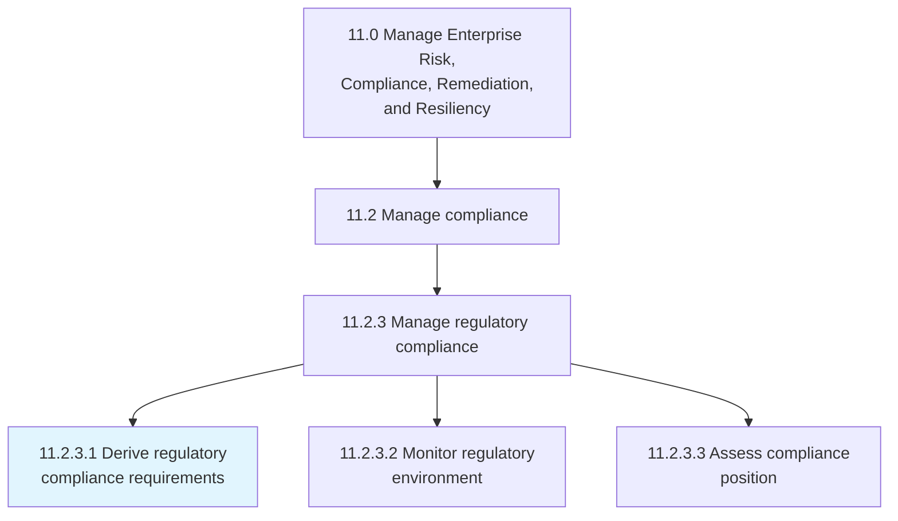
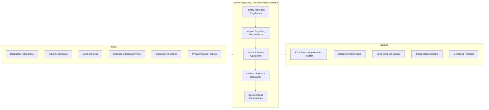
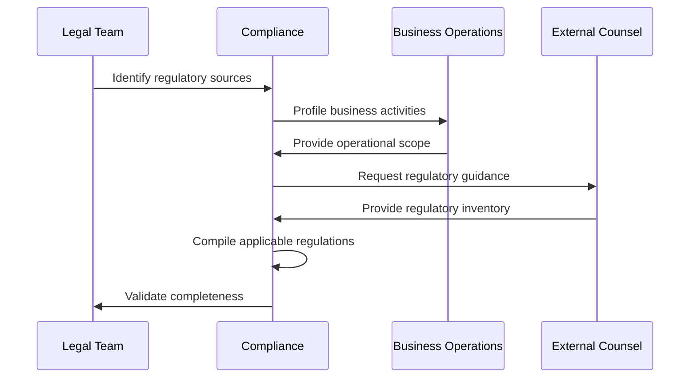
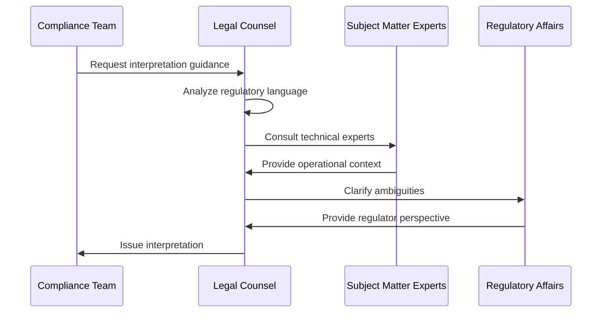
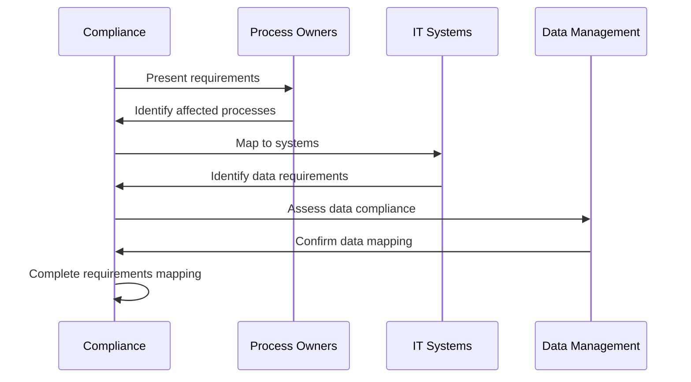
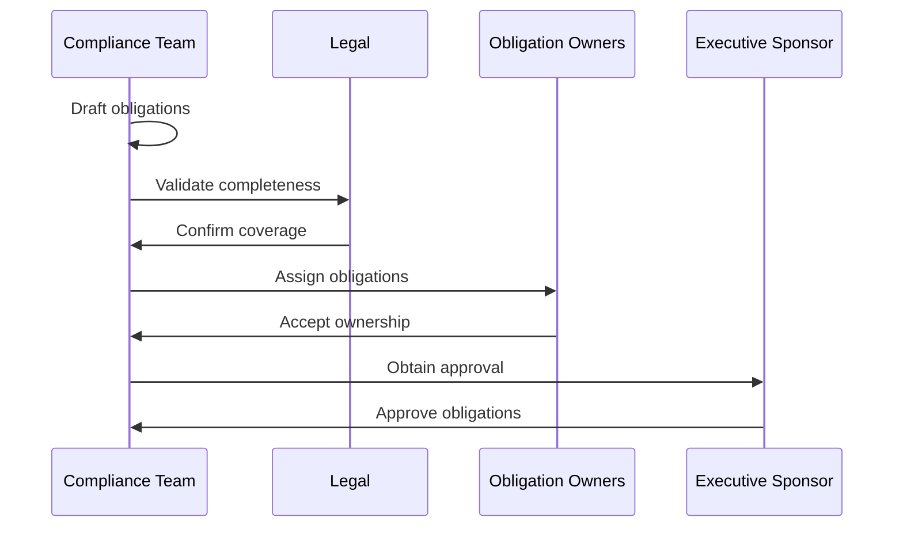
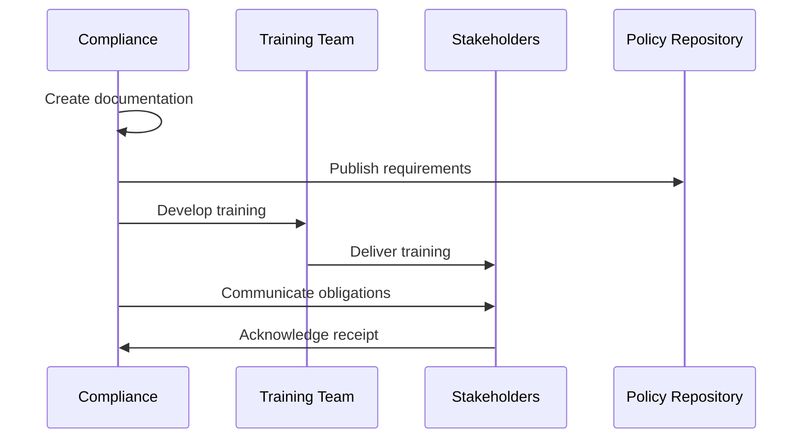
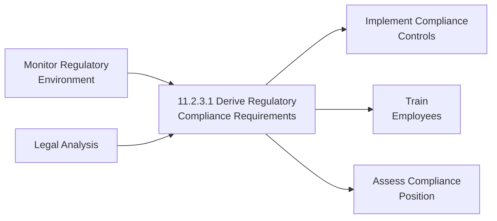

# Derive regulatory compliance requirements

> Meeting regulatory requirements set forth by such directives as RoHS, WEEE, ELV, and REACH.

## Overview

Derive regulatory compliance requirements (APQC 11.2.3.1) is a critical activity within the compliance management process that ensures organizations identify, interpret, and operationalize all applicable regulatory requirements. This process involves systematically analyzing regulatory frameworks, determining their applicability to organizational operations, and translating legal requirements into actionable compliance obligations.

Effective regulatory requirement derivation enables organizations to maintain legal compliance, avoid penalties and sanctions, protect their license to operate, and build stakeholder trust. The process requires deep expertise in regulatory analysis, cross-functional collaboration, and robust documentation to ensure complete coverage of all applicable requirements.

## Process Hierarchy



## Key Statistics

| Metric | Value |
|--------|-------|
| APQC Code | 16811 |
| Hierarchy ID | 11.2.3.1 |
| Level | Activity |
| Category | [Manage Enterprise Risk, Compliance, Remediation, and Resiliency](/processes/11-Risk) |
| Parent Process | [Manage regulatory compliance](./index.mdx) |

## Process Flow



## GraphDL Semantic Structure

```
derive.RegulatoryComplianceRequirements
```

| Component | Value | Description |
|-----------|-------|-------------|
| Verb | `derive` | Primary action of extracting and determining |
| Object | `RegulatoryComplianceRequirements` | Legal and regulatory obligations |
| Preposition | - | Not applicable |
| PrepObject | - | Not applicable |

## Activities

### Identify Applicable Regulations

Systematically scanning the regulatory landscape to identify all laws, regulations, and standards that apply to organizational operations.



**Tasks:**
- `scan.RegulatoryLandscape` - Monitor regulatory publications and updates
- `profile.BusinessOperations` - Document operational activities and scope
- `assess.GeographicApplicability` - Determine jurisdictional requirements
- `identify.IndustryRegulations` - Catalog industry-specific requirements

### Interpret Regulatory Requirements

Analyzing regulatory text to understand the specific requirements, obligations, and compliance expectations.



**Tasks:**
- `analyze.RegulatoryText` - Parse legal language and requirements
- `consult.LegalExperts` - Obtain legal interpretation guidance
- `clarify.Ambiguities` - Resolve unclear requirements
- `document.Interpretations` - Record interpretation decisions

### Map to Business Operations

Connecting regulatory requirements to specific business processes, systems, and organizational functions.



**Tasks:**
- `map.ProcessImpacts` - Identify affected business processes
- `identify.SystemRequirements` - Determine IT system implications
- `assess.DataObligations` - Map data protection requirements
- `determine.OrganizationalImpacts` - Identify affected departments

### Define Compliance Obligations

Translating regulatory requirements into specific, actionable compliance obligations with clear ownership.



**Tasks:**
- `define.SpecificObligations` - Articulate discrete compliance requirements
- `assign.Ownership` - Designate responsible parties
- `establish.Timelines` - Set compliance deadlines
- `determine.EvidenceRequirements` - Define compliance documentation

### Document and Communicate

Creating comprehensive documentation and communicating requirements to all affected stakeholders.



**Tasks:**
- `create.ComplianceDocumentation` - Prepare formal documentation
- `develop.TrainingMaterials` - Create educational content
- `communicate.Requirements` - Distribute to stakeholders
- `track.Acknowledgments` - Monitor stakeholder awareness

## RACI Matrix

| Activity | Responsible | Accountable | Consulted | Informed |
|----------|-------------|-------------|-----------|----------|
| Identify applicable regulations | Compliance Team | Chief Compliance Officer | Legal, External Counsel | Business Units |
| Interpret regulatory requirements | Legal Counsel | General Counsel | Compliance, SMEs | Executive Team |
| Map to business operations | Process Owners | CCO | IT, Data Management | Compliance Team |
| Define compliance obligations | Compliance Team | CCO | Legal, Process Owners | All Affected Parties |
| Document and communicate | Compliance Team | CCO | Training, Communications | All Employees |

## Related Departments

- [Legal](/departments/Legal) - Regulatory interpretation and guidance
- [Compliance](/departments/Compliance) - Requirements derivation coordination
- [Regulatory Affairs](/departments/RegulatoryAffairs) - Regulatory relationship management
- [Operations](/departments/Operations) - Business process mapping
- [IT](/departments/IT) - System requirements identification

## Related Occupations

- [Compliance Officers](/occupations/ComplianceOfficers) - Requirements derivation leadership
- [Regulatory Affairs Specialists](/occupations/RegulatorySpecialists) - Regulatory expertise
- [Corporate Counsel](/occupations/Lawyers) - Legal interpretation
- [Business Analysts](/occupations/BusinessAnalysts) - Process mapping
- [Policy Analysts](/occupations/PolicyAnalysts) - Regulatory analysis

## Industry Variations

### Aerospace and Defense

Aerospace regulatory requirements derive from aviation safety regulations (FAA, EASA), export controls (ITAR, EAR), defense acquisition regulations (FAR/DFAR), and quality management standards (AS9100). Requirements vary significantly between commercial and defense segments.

**Industry-Specific Activities:**
- Derive FAA/EASA airworthiness requirements
- Interpret export control obligations
- Map defense acquisition compliance
- Identify quality system requirements

### Automotive

Automotive compliance requirements include vehicle safety regulations, emissions standards, product recall requirements, and increasingly, software and cybersecurity regulations for connected vehicles.

**Industry-Specific Activities:**
- Derive vehicle safety requirements (FMVSS)
- Interpret emissions regulations (EPA, CARB)
- Map recall notification obligations
- Identify connected vehicle requirements

### Banking

Banking regulatory requirements span prudential regulations (capital, liquidity), consumer protection, anti-money laundering, market conduct, and data privacy. Requirements vary by jurisdiction and charter type.

**Industry-Specific Activities:**
- Derive capital adequacy requirements (Basel)
- Interpret AML/KYC obligations
- Map consumer protection requirements
- Identify data privacy obligations (GDPR, CCPA)

### Consumer Products

Consumer products companies must derive requirements from product safety regulations, environmental directives (RoHS, WEEE, REACH), labeling requirements, and advertising standards.

**Industry-Specific Activities:**
- Derive product safety requirements
- Interpret RoHS material restrictions
- Map WEEE recycling obligations
- Identify REACH substance requirements

### Healthcare Provider

Healthcare regulatory requirements include patient safety regulations, privacy requirements (HIPAA), billing compliance, quality reporting, and professional licensing requirements.

**Industry-Specific Activities:**
- Derive HIPAA privacy requirements
- Interpret billing compliance rules
- Map quality reporting obligations
- Identify professional licensing requirements

### Life Sciences

Pharmaceutical and biotech requirements include clinical trial regulations, manufacturing standards (cGMP), product approval requirements, and pharmacovigilance obligations.

**Industry-Specific Activities:**
- Derive FDA clinical trial requirements
- Interpret cGMP manufacturing standards
- Map product registration obligations
- Identify pharmacovigilance requirements

### Utilities

Utility companies derive requirements from energy regulations, environmental permits, grid reliability standards (NERC), and customer protection rules.

**Industry-Specific Activities:**
- Derive NERC reliability requirements
- Interpret environmental permit obligations
- Map rate case compliance requirements
- Identify customer protection rules

## Sub-Processes

| Process | Code | Description |
|---------|------|-------------|
| Identify applicable regulations | - | Scan regulatory landscape for applicability |
| Interpret regulatory requirements | - | Analyze and understand requirements |
| Map to business operations | - | Connect requirements to processes |
| Define compliance obligations | - | Translate to actionable obligations |
| Document and communicate | - | Create and distribute documentation |

## Related Processes



## Metrics & KPIs

| Metric | Description | Target |
|--------|-------------|--------|
| Requirement Coverage | Percentage of regulations analyzed | 100% |
| Derivation Timeliness | Time from regulation to requirement | <30 days |
| Accuracy Rate | Requirements correctly derived | >98% |
| Mapping Completeness | Obligations mapped to processes | 100% |
| Stakeholder Awareness | Employees aware of requirements | >95% |
| Update Currency | Requirements updated after changes | <15 days |

---

*Source: APQC PCF 16811 (11.2.3.1) - Cross-Industry*
