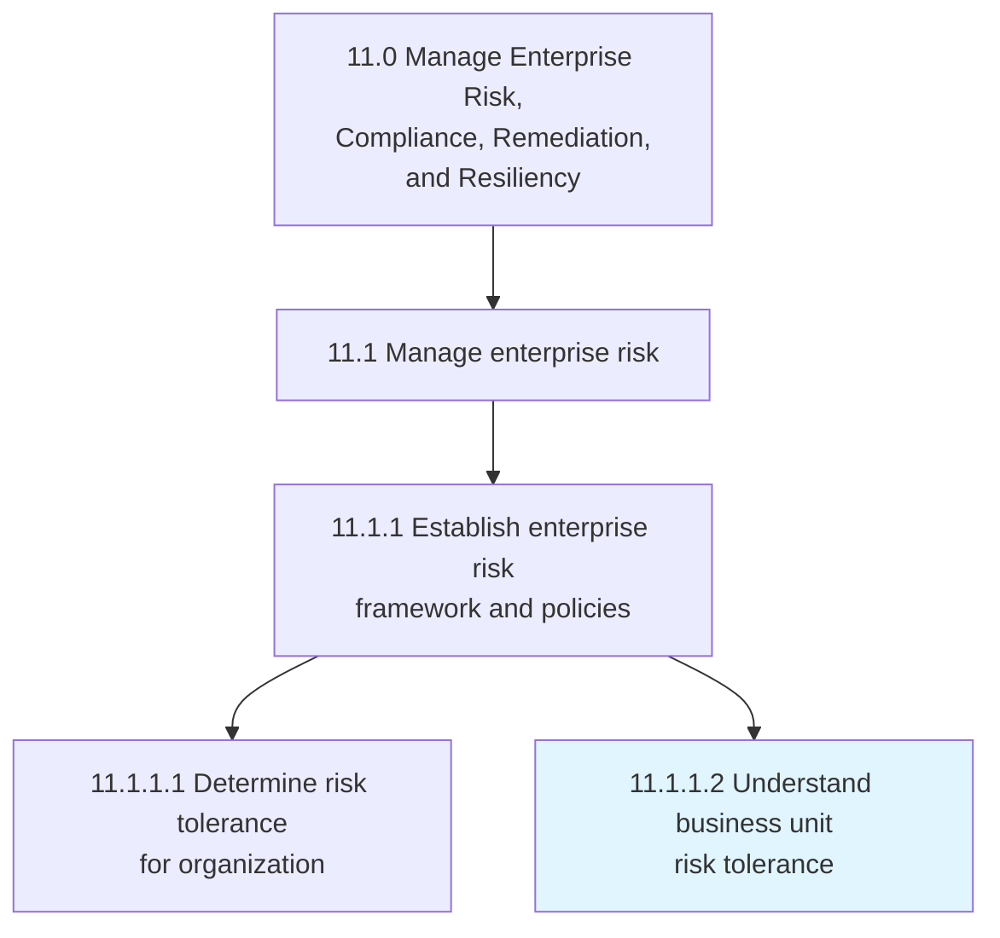
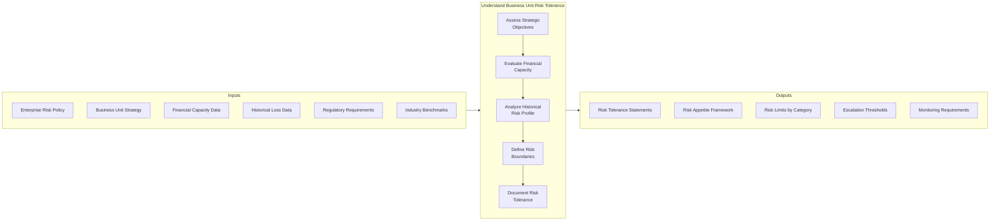
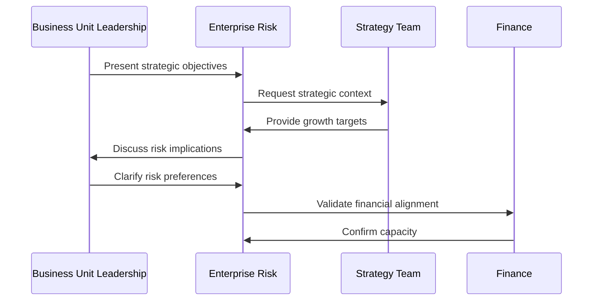
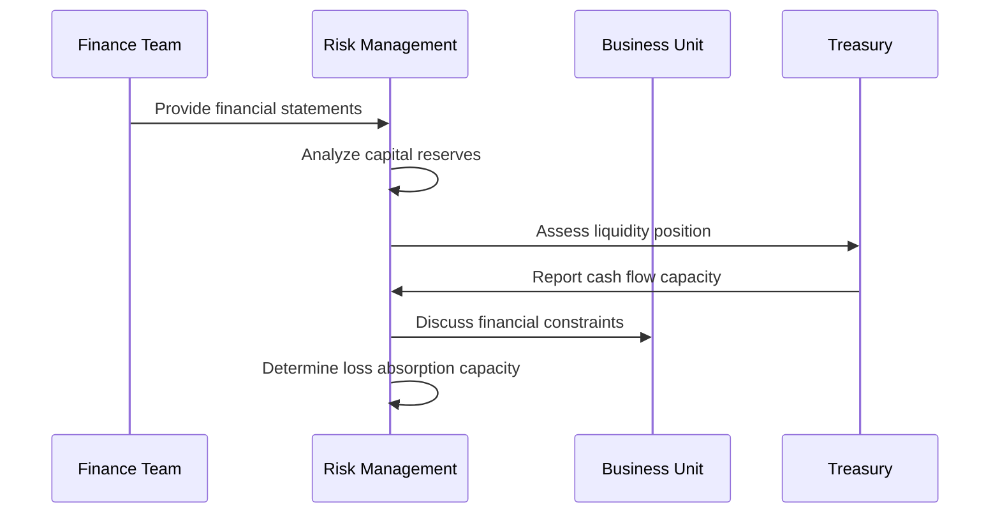
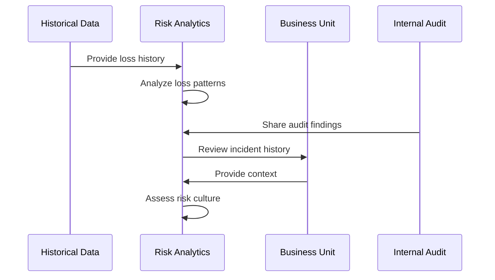
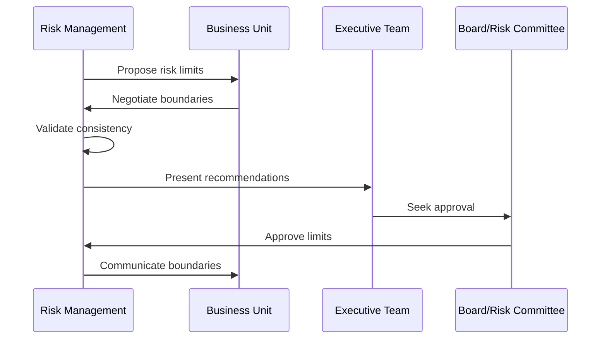
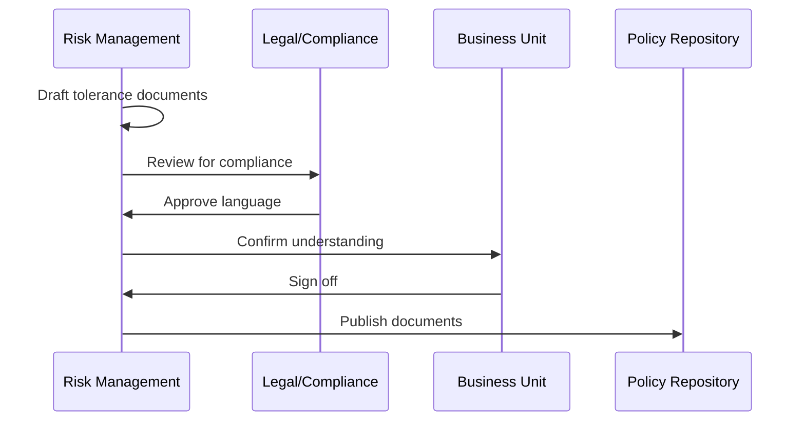
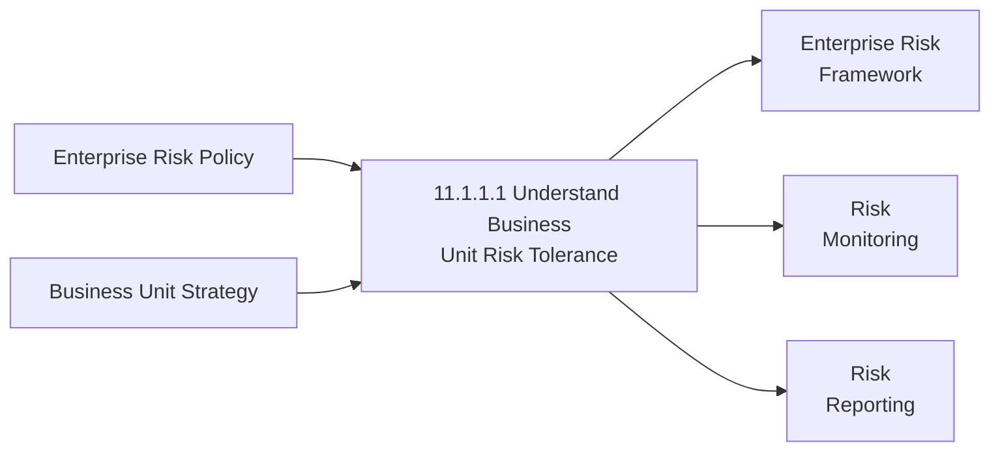

# Understand business unit risk tolerance

> Understand the risk tolerance levels of individual business units, given risk-return trade-offs for one or more anticipated and predictable consequences.

## Overview

Understand business unit risk tolerance (APQC 11.1.1.1) is a foundational activity within the enterprise risk management framework that enables organizations to calibrate risk management strategies to the specific needs and capacities of different business units. This process involves assessing each unit's appetite for risk, their capacity to absorb potential losses, and their strategic objectives to establish appropriate risk boundaries.

Effective risk tolerance assessment ensures that enterprise-wide risk policies can be appropriately tailored to different operational contexts while maintaining overall organizational risk within acceptable limits. The process requires close collaboration between corporate risk functions and business unit leadership to balance growth opportunities with prudent risk management.

## Process Hierarchy



## Key Statistics

| Metric | Value |
|--------|-------|
| APQC Code | 20940 |
| Hierarchy ID | 11.1.1.1 |
| Level | Activity |
| Category | [Manage Enterprise Risk, Compliance, Remediation, and Resiliency](/processes/11-Risk) |
| Parent Process | [Establish enterprise risk framework and policies](./index.mdx) |

## Process Flow



## GraphDL Semantic Structure

```
understand.BusinessUnitRiskTolerance
```

| Component | Value | Description |
|-----------|-------|-------------|
| Verb | `understand` | Primary action of comprehending and assessing |
| Object | `BusinessUnitRiskTolerance` | Acceptable risk levels for business units |
| Preposition | - | Not applicable |
| PrepObject | - | Not applicable |

## Activities

### Assess Strategic Objectives

Reviewing business unit strategic plans and objectives to understand the risk-return trade-offs inherent in their growth strategies.



**Tasks:**
- `review.StrategicPlans` - Examine business unit growth strategies
- `identify.GrowthTargets` - Understand revenue and market objectives
- `assess.RiskImplications` - Evaluate risks inherent in strategies
- `align.RiskAppetite` - Match risk tolerance to strategic goals

### Evaluate Financial Capacity

Analyzing the business unit's financial resources and ability to absorb potential losses without jeopardizing operations.



**Tasks:**
- `analyze.CapitalReserves` - Assess available capital buffers
- `evaluate.LiquidityPosition` - Review cash and liquidity resources
- `determine.LossCapacity` - Calculate maximum absorbable loss
- `assess.InsuranceCoverage` - Review risk transfer mechanisms

### Analyze Historical Risk Profile

Examining past risk events, losses, and near-misses to understand the business unit's actual risk exposure and management effectiveness.



**Tasks:**
- `compile.LossHistory` - Gather historical loss and incident data
- `analyze.RiskPatterns` - Identify recurring risk themes
- `evaluate.NearMisses` - Assess incidents that could have caused loss
- `assess.RiskCulture` - Evaluate risk awareness and behaviors

### Define Risk Boundaries

Establishing specific risk limits and thresholds tailored to the business unit's tolerance and capacity.



**Tasks:**
- `establish.QuantitativeLimits` - Set numerical risk thresholds
- `define.QualitativeBoundaries` - Articulate risk tolerance statements
- `set.EscalationTriggers` - Define when escalation is required
- `align.EnterprisePolicy` - Ensure consistency with corporate policy

### Document Risk Tolerance

Formalizing risk tolerance statements, limits, and monitoring requirements for ongoing governance.



**Tasks:**
- `create.ToleranceStatements` - Write formal risk tolerance declarations
- `document.RiskLimits` - Record quantitative limits by risk category
- `establish.MonitoringProtocol` - Define ongoing monitoring requirements
- `communicate.Stakeholders` - Distribute to relevant parties

## RACI Matrix

| Activity | Responsible | Accountable | Consulted | Informed |
|----------|-------------|-------------|-----------|----------|
| Assess strategic objectives | Business Unit Head | Chief Risk Officer | Strategy, Finance | Board |
| Evaluate financial capacity | Finance Team | CFO | Treasury, Risk | Business Unit |
| Analyze historical risk profile | Risk Analytics | CRO | Internal Audit | Management |
| Define risk boundaries | Risk Management | CRO | Business Unit, Legal | Executive Team |
| Document risk tolerance | Risk Management | CRO | Legal, Compliance | All Business Units |

## Related Departments

- [Enterprise Risk Management](/departments/ERM) - Overall risk tolerance coordination
- [Finance](/departments/Finance) - Financial capacity assessment
- [Strategy](/departments/Strategy) - Strategic objectives alignment
- [Internal Audit](/departments/InternalAudit) - Historical risk assessment validation
- [Legal](/departments/Legal) - Regulatory requirement integration

## Related Occupations

- [Chief Risk Officers](/occupations/CRO) - Enterprise risk oversight
- [Risk Managers](/occupations/RiskManagers) - Risk tolerance assessment
- [Financial Analysts](/occupations/FinancialAnalysts) - Capacity analysis
- [Business Unit Managers](/occupations/GeneralManagers) - Tolerance input
- [Internal Auditors](/occupations/InternalAuditors) - Historical risk review

## Industry Variations

### Aerospace and Defense

Risk tolerance in aerospace and defense is heavily influenced by program-specific requirements, government contract terms, and safety-critical considerations. Risk tolerance often varies significantly between commercial and defense segments.

**Industry-Specific Activities:**
- Assess program-specific risk tolerance
- Evaluate contract risk provisions
- Consider safety-critical requirements
- Align with government risk-sharing arrangements

### Banking

Banks define risk tolerance within strict regulatory frameworks (Basel requirements, stress testing). Risk appetite statements must address credit, market, operational, and liquidity risks with specific quantitative limits.

**Industry-Specific Activities:**
- Define credit risk appetite by segment
- Establish market risk limits
- Set operational risk tolerance
- Determine liquidity risk boundaries

### Healthcare Provider

Healthcare risk tolerance must balance clinical quality, patient safety, financial sustainability, and regulatory compliance. Different tolerance levels may apply to clinical vs. administrative functions.

**Industry-Specific Activities:**
- Establish clinical risk tolerance
- Define patient safety thresholds
- Set financial risk boundaries
- Address compliance risk limits

### Property and Casualty Insurance

Insurance companies have sophisticated risk tolerance frameworks addressing underwriting, claims, investment, and catastrophe risks. Reinsurance strategies directly reflect risk tolerance decisions.

**Industry-Specific Activities:**
- Set underwriting risk limits
- Define catastrophe risk tolerance
- Establish investment risk boundaries
- Determine reinsurance retention levels

### Life Sciences

Pharmaceutical and biotech risk tolerance addresses clinical trial risks, regulatory approval uncertainties, and product liability exposure. Pipeline stage influences risk tolerance significantly.

**Industry-Specific Activities:**
- Define clinical trial risk tolerance
- Establish regulatory risk appetite
- Set product liability limits
- Address supply chain risk boundaries

## Sub-Processes

| Process | Code | Description |
|---------|------|-------------|
| Assess strategic objectives | - | Review business unit strategies and goals |
| Evaluate financial capacity | - | Analyze loss absorption capability |
| Analyze historical risk profile | - | Examine past risk events and patterns |
| Define risk boundaries | - | Establish specific risk limits |
| Document risk tolerance | - | Formalize and communicate tolerances |

## Related Processes



## Metrics & KPIs

| Metric | Description | Target |
|--------|-------------|--------|
| Tolerance Coverage | Business units with documented tolerance | 100% |
| Assessment Currency | Freshness of tolerance assessments | <12 months |
| Limit Breaches | Instances of tolerance limit breaches | <5 per year |
| Alignment Score | Consistency with enterprise policy | >95% |
| Stakeholder Understanding | BU leaders understanding of tolerance | >90% |
| Update Timeliness | Time to update after strategy changes | <30 days |

---

*Source: APQC PCF 20940 (11.1.1.1) - Cross-Industry*
