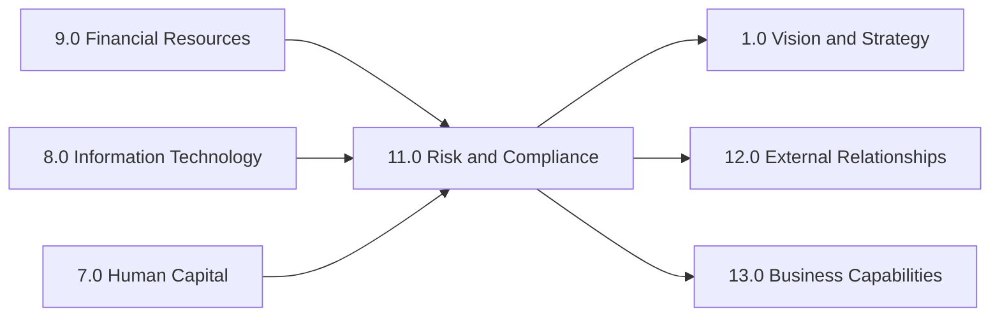

# Risk And Compliance

> Ensuring that an organization effectively manages its risk. Process groups are aligned with traditional risk management activities including enterprise risk management, compliance management, regulatory compliance, remediation efforts, and business resiliency.

## Overview

APQC Category 11.0 - Manage Enterprise Risk, Compliance, Remediation, and Resiliency encompasses all processes related to identifying, assessing, mitigating, and monitoring organizational risks. This category represents the critical governance functions that protect organizations from operational, financial, regulatory, and strategic threats while ensuring compliance with applicable laws and regulations.

Modern risk and compliance management has evolved from a purely defensive function to a strategic enabler that supports informed decision-making, protects stakeholder value, and builds organizational resilience. These processes integrate across all business functions, providing the frameworks, policies, and controls necessary for sustainable operations.

## Process Hierarchy

```mermaid
graph TD
    C11["11.0 Manage Enterprise Risk,<br/>Compliance, Remediation,<br/>and Resiliency"] --> G111["11.1 Manage enterprise risk"]
    C11 --> G112["11.2 Manage compliance"]
    C11 --> G113["11.3 Manage remediation efforts"]
    C11 --> G114["11.4 Manage business resiliency"]

    G111 --> P1111["11.1.1 Establish enterprise risk<br/>framework and policies"]
    G111 --> P1112["11.1.2 Oversee and coordinate enterprise<br/>risk management activities"]
    G111 --> P1113["11.1.3 Coordinate business unit and<br/>functional risk management"]
    G111 --> P1114["11.1.4 Manage business unit<br/>and function risk"]

    G112 --> P1121["11.2.1 Establish compliance<br/>framework and policies"]
    G112 --> P1122["11.2.2 Manage internal audits"]
    G112 --> P1123["11.2.3 Manage regulatory compliance"]

    G113 --> P1131["11.3.1 Create remediation plans"]
    G113 --> P1132["11.3.2 Contact and confer with experts"]
    G113 --> P1133["11.3.3 Identify/dedicate resources"]

    G114 --> P1141["11.4.1 Develop business<br/>resilience strategy"]
    G114 --> P1142["11.4.2 Perform continuous business<br/>operations planning"]
    G114 --> P1143["11.4.3 Test continuous<br/>business operations"]
```

## Key Statistics

| Metric | Value |
|--------|-------|
| APQC Code | 16437 |
| Hierarchy ID | 11.0 |
| Level | Category |
| Process Groups | 4 |
| Total Processes | 50+ |

## Processes in this Category

### 11.1 Manage enterprise risk

Creating requisite frameworks and coordinating all risk management activities for the entire organization and each function.

- [Understand business unit risk tolerance](./RiskTolerance.mdx) - Activity 11.1.1.1

### 11.2 Manage compliance

Managing steps to confirm enduring compliance to industry regulations and government legislation.

- [Derive regulatory compliance requirements](./RegulatoryRequirements.mdx) - Process 11.2.3.1

### 11.3 Manage remediation efforts

Administering the efforts and activities for remediation including creating corrective action plans.

- [Report incidents and risks to regulatory bodies](./IncidentReporting.mdx) - Activity 11.3.2

### 11.4 Manage business resiliency

Including processes required to rapidly adapt and respond to internal or external opportunities, demands, disruptions, or threats.

- [Assess SLA compliance](./SlaCompliance.mdx) - Activity 11.4.1
- [Triage SLA compliance issues](./ComplianceTriage.mdx) - Activity 11.4.2

## Related Categories

## Industry Considerations

Risk and compliance requirements vary significantly by industry:

| Industry | Key Focus Areas |
|----------|-----------------|
| Banking | Basel requirements, capital adequacy, AML/KYC |
| Healthcare | HIPAA, patient safety, clinical compliance |
| Aerospace | FAA/EASA regulations, safety management |
| Life Sciences | FDA compliance, clinical trials, pharmacovigilance |
| Utilities | NERC CIP, environmental compliance |

---

*Source: APQC PCF Category 11.0 - Cross-Industry*
