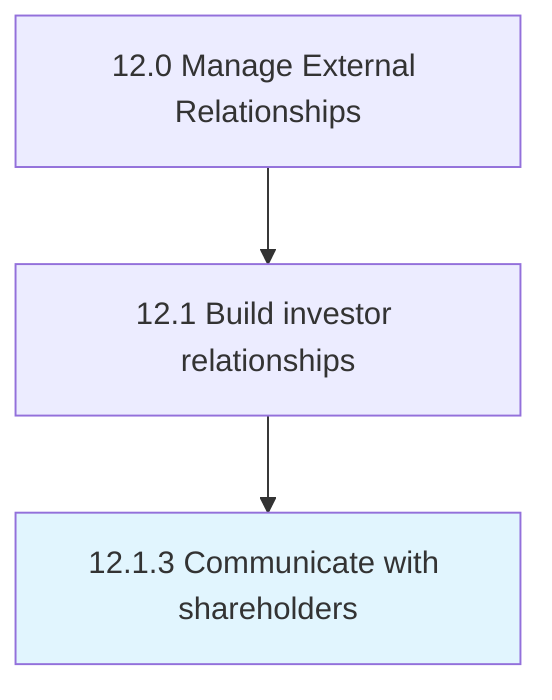

# Communicate with shareholders

> Practicing regular, transparent communication with shareholders through annual shareholders' meetings, quarterly earnings calls, shareholders letters, one-on-one emails or calls, etc.

## Overview

Process 12.1.3 is a core process that defines the specific procedures for communicate with shareholders. 

Practicing regular, transparent communication with shareholders through annual shareholders' meetings, quarterly earnings calls, shareholders letters, one-on-one emails or calls, etc.

## Process Hierarchy



## Key Statistics

| Metric | Value |
|--------|-------|
| APQC Code | 11037 |
| Hierarchy ID | 12.1.3 |
| Level | Process |
| Parent | [12.1](../) |
| Sub-Processes | 0 |


## GraphDL Semantic Structure

```
communicate.WithShareholders
```

| Component | Value | Description |
|-----------|-------|-------------|
| Verb | `communicate` | Primary action |
| Object | `with shareholders` | Direct object |


## Related Concepts

- Shareholders


---

*Source: APQC PCF 11037 (12.1.3) - APQC*
