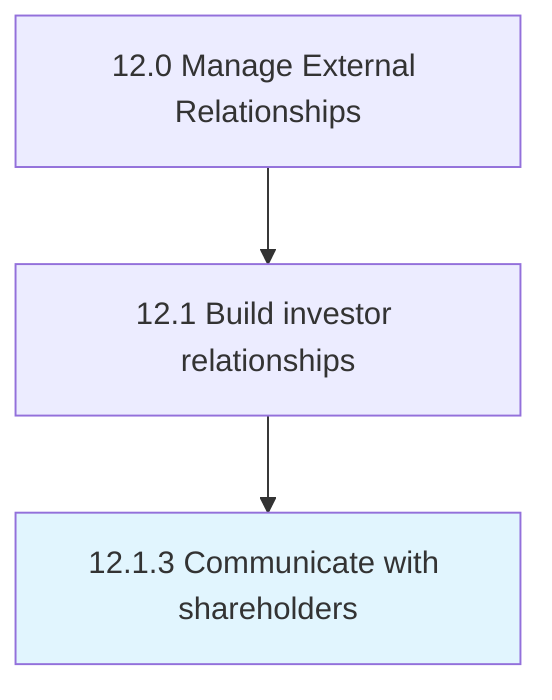
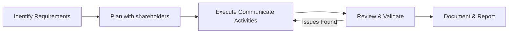

# Communicate with shareholders

> Practicing regular, transparent communication with shareholders through annual shareholders' meetings, quarterly earnings calls, shareholders letters, one-on-one emails or calls, etc.

## Overview

The communicate with shareholders process is a critical component of the External Relationships function within an organization. It encompasses the systematic approach to communicate with shareholders, ensuring that all activities are performed consistently, efficiently, and in alignment with organizational objectives. This process establishes the framework through which communicate with shareholders is executed, monitored, and continuously improved to deliver value across the enterprise.

Within the APQC Process Classification Framework (hierarchy 12.1.3), this process supports the broader "Manage External Relationships" category. Effective execution requires cross-functional collaboration, clear accountability, and robust governance mechanisms. Organizations that mature this process typically see improved operational performance, reduced risk exposure, and stronger alignment between tactical activities and strategic goals.


## Process Hierarchy



## Key Statistics

| Metric | Value |
|--------|-------|
| APQC Code | 11037 |
| Hierarchy ID | 12.1.3 |
| Level | Process |
| Parent | [12.1](../) |
| Sub-Processes | 0 |


## GraphDL Semantic Structure

```
communicate.WithShareholders
```

| Component | Value | Description |
|-----------|-------|-------------|
| Verb | `communicate` | Primary action |
| Object | `with shareholders` | Direct object |


## Process Flow



## RACI Matrix

| Activity | Manager | Specialist | Manager | Director |
|----------|------|------|------|------|
| Planning & Scoping | R | A | C | I |
| Execution | A | C | I | R |
| Review & Approval | C | I | R | A |
| Reporting | I | R | A | C |

## Related Occupations

- [Government Relations Manager](/occupations/GovernmentRelationsManager)
- [Public Relations Specialist](/occupations/PublicRelationsSpecialist)
- [Community Relations Manager](/occupations/CommunityRelationsManager)
- [Investor Relations Director](/occupations/InvestorRelationsDirector)

## Related Departments

- Corporate Affairs
- Public Relations
- Government Relations

## Industry Variations

### Pharmaceutical

Regulatory agency engagement (FDA, EMA), patient advocacy group relationships, and healthcare provider communication programs.

### Banking

Regulatory body relationships (OCC, FDIC), community reinvestment obligations, and shareholder communication requirements.

### Technology

Open-source community engagement, developer relations programs, industry consortium participation, and standards body involvement.

## KPIs & Metrics

| KPI | Target | Measurement Frequency |
|-----|--------|----------------------|
| Stakeholder Satisfaction Score | > 4.0/5.0 | Annually |
| Regulatory Response Time | < 48 hours | Per Inquiry |
| Community Engagement Events | > 12/year | Quarterly |
| Media Sentiment Score | Positive trend | Monthly |

## Related Concepts

- Shareholders


---

*Source: APQC PCF 11037 (12.1.3) - APQC*
