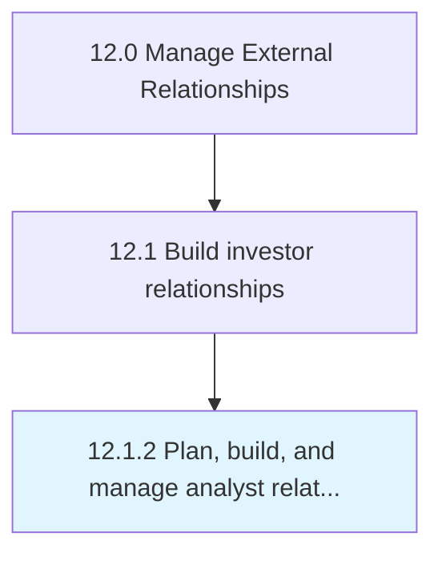

# Plan, build, and manage analyst relations

> Creating and maintaining long-term relations with analysts.

## Overview

Process 12.1.2 is a core process that defines the specific procedures for plan, build, and manage analyst relations. 

Creating and maintaining long-term relations with analysts. Involve analysts in strategy and product decisions in order to elicit valuable information.

## Process Hierarchy



## Key Statistics

| Metric | Value |
|--------|-------|
| APQC Code | 11036 |
| Hierarchy ID | 12.1.2 |
| Level | Process |
| Parent | [12.1](../) |
| Sub-Processes | 0 |


## GraphDL Semantic Structure

```
plan,.BuildAndManageAnalystRelations
```

| Component | Value | Description |
|-----------|-------|-------------|
| Verb | `plan,` | Primary action |
| Object | `build, and manage analyst relations` | Direct object |


## Related Concepts

- AnalystRelations
- AnalystRelations
- AnalystRelations


---

*Source: APQC PCF 11036 (12.1.2) - APQC*
