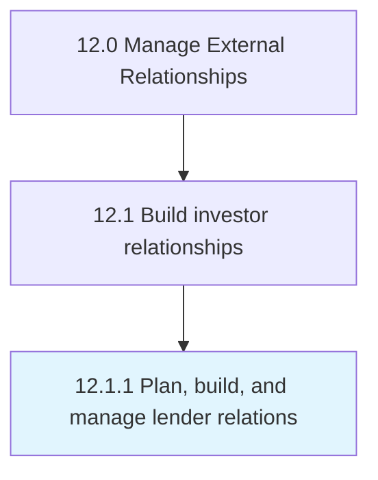

# Plan, build, and manage lender relations

> Building and managing relations with bankers or lenders through strong products/services strategies that bankers would want to invest in.

## Overview

Process 12.1.1 is a core process that defines the specific procedures for plan, build, and manage lender relations. 

Building and managing relations with bankers or lenders through strong products/services strategies that bankers would want to invest in. Foster a receptive environment for low rates of interest, easy access to loans, etc.

## Process Hierarchy



## Key Statistics

| Metric | Value |
|--------|-------|
| APQC Code | 11035 |
| Hierarchy ID | 12.1.1 |
| Level | Process |
| Parent | [12.1](../) |
| Sub-Processes | 0 |


## GraphDL Semantic Structure

```
plan,.BuildAndManageLenderRelations
```

| Component | Value | Description |
|-----------|-------|-------------|
| Verb | `plan,` | Primary action |
| Object | `build, and manage lender relations` | Direct object |


## Related Concepts

- LenderRelations
- LenderRelations
- LenderRelations


---

*Source: APQC PCF 11035 (12.1.1) - APQC*
