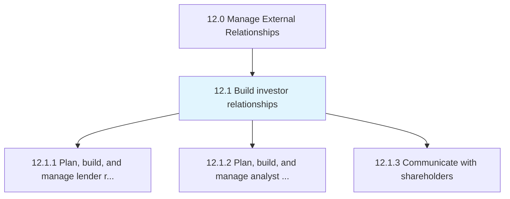
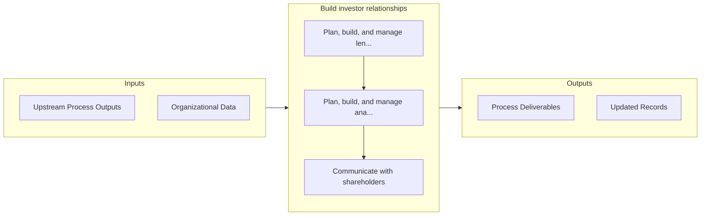

# Build investor relationships

> Creating a strategic management responsibility for integrating finance, communication, marketing, and securities law compliance.

## Overview

Group 12.1 is a process group within APQC Category 12.0 (Manage External Relationships). 

Creating a strategic management responsibility for integrating finance, communication, marketing, and securities law compliance. Allow the most effective two-way communication among the organization, the financial community, and other constituencies. Enlist the investor relations function to provide market intelligence to corporate management.

## Process Hierarchy



## Key Statistics

| Metric | Value |
|--------|-------|
| APQC Code | 11010 |
| Hierarchy ID | 12.1 |
| Level | Group |
| Parent | [12](../) |
| Sub-Processes | 3 |


## GraphDL Semantic Structure

```
build.InvestorRelationships
```

| Component | Value | Description |
|-----------|-------|-------------|
| Verb | `build` | Primary action |
| Object | `investor relationships` | Direct object |


## Process Flow



## Sub-Processes

| Process | Hierarchy ID | Description |
|---------|-------------|-------------|
| [Plan, build, and manage lender relations](./PlanBuildAndManageLenderRelations) | 12.1.1 | Building and managing relations with bankers or lenders through strong products/services strategies  |
| [Plan, build, and manage analyst relations](./PlanBuildAndManageAnalystRelations) | 12.1.2 | Creating and maintaining long-term relations with analysts |
| [Communicate with shareholders](./CommunicateWithShareholders) | 12.1.3 | Practicing regular, transparent communication with shareholders through annual shareholders' meeting |


## Related Concepts

- InvestorRelationships


---

*Source: APQC PCF 11010 (12.1) - APQC*
