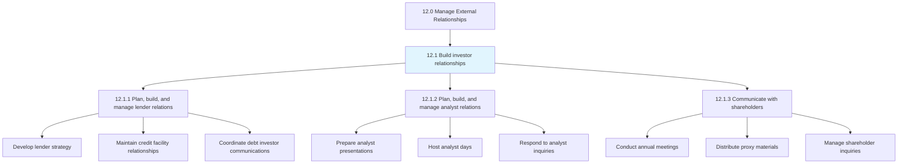
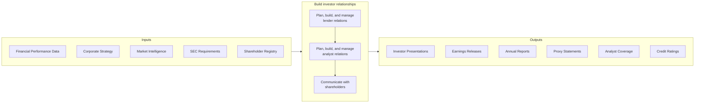
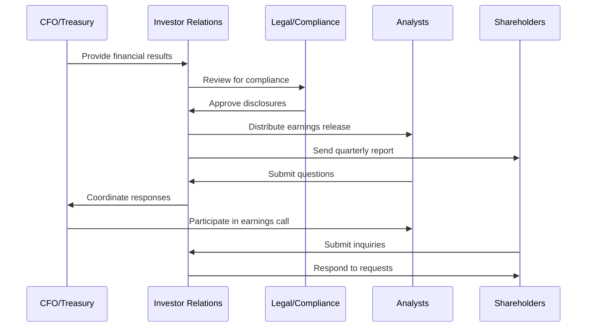
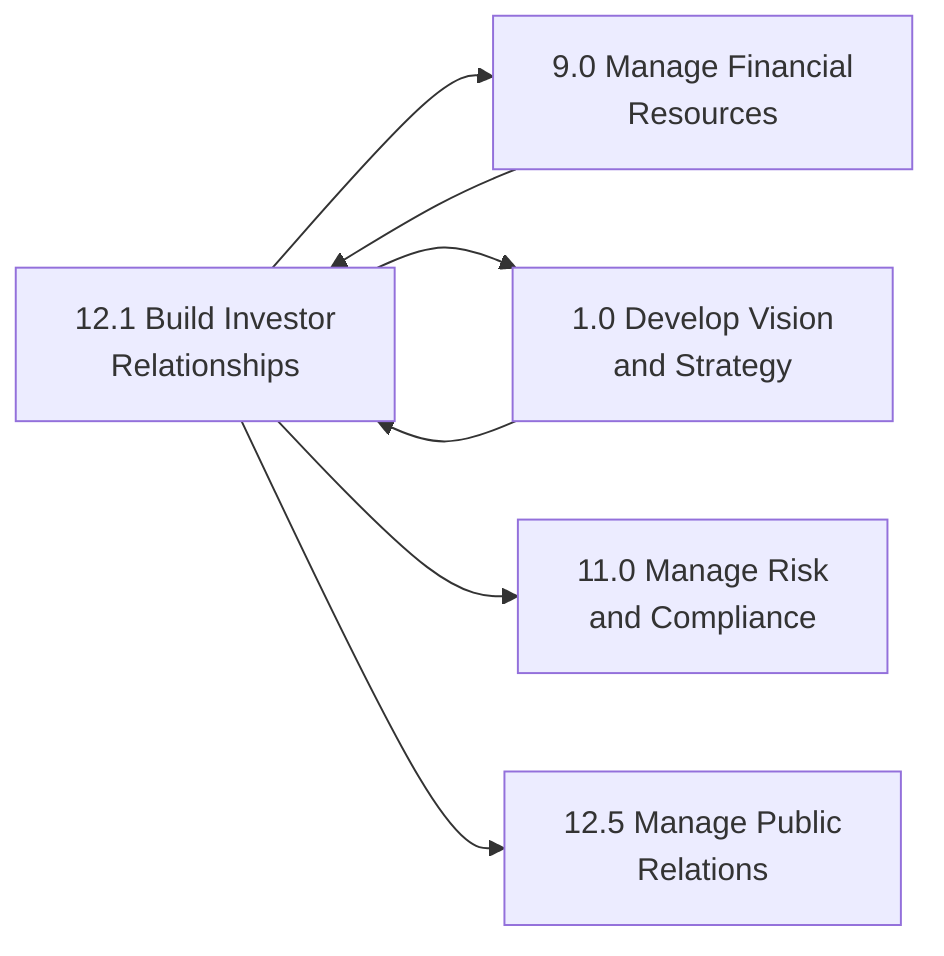

# Build investor relationships

> Creating a strategic management responsibility for integrating finance, communication, marketing, and securities law compliance.

## Overview

Group 12.1 is a process group within APQC Category 12.0 (Manage External Relationships).

Building investor relationships is a critical strategic function that integrates finance, communication, marketing, and securities law compliance to enable effective two-way communication between the organization, the financial community, and other key constituencies. The investor relations function serves as a vital bridge, providing market intelligence to corporate management while ensuring transparent, consistent messaging to the investment community.

Effective investor relations builds trust with shareholders, attracts potential investors, and supports fair valuation of the company's securities. This process group encompasses managing relationships with lenders (banks and debt holders), analysts (sell-side and buy-side), and shareholders (institutional and retail investors). Organizations with mature investor relations capabilities demonstrate stronger stock performance, lower cost of capital, and enhanced corporate reputation.

Key activities include preparing earnings releases, coordinating investor conferences, managing analyst expectations, responding to shareholder inquiries, and ensuring compliance with securities regulations such as Regulation FD (Fair Disclosure).

## Process Hierarchy



## Key Statistics

| Metric | Value |
|--------|-------|
| APQC Code | 11010 |
| Hierarchy ID | 12.1 |
| Level | Group |
| Parent | [12.0 Manage External Relationships](../) |
| Sub-Processes | 3 |
| Industry Applicability | All public companies, large private companies |


## GraphDL Semantic Structure

```graphdl
build.InvestorRelationships
```

| Component | Value | Description |
|-----------|-------|-------------|
| Verb | `build` | Primary action - constructive, ongoing development |
| Object | `investor relationships` | Direct object - the stakeholder connections being developed |


## Process Flow



## Sub-Processes

| Process | Hierarchy ID | Description |
|---------|-------------|-------------|
| [Plan, build, and manage lender relations](./PlanBuildAndManageLenderRelations) | 12.1.1 | Building and managing relations with bankers and lenders through strong product/service strategies, operational excellence, and transparent financial communication. Includes maintaining credit facilities, managing debt covenants, and coordinating with rating agencies. |
| [Plan, build, and manage analyst relations](./PlanBuildAndManageAnalystRelations) | 12.1.2 | Creating and maintaining long-term relationships with sell-side and buy-side analysts. Includes preparing quarterly earnings materials, hosting analyst days, participating in investor conferences, and managing consensus estimates. |
| [Communicate with shareholders](./CommunicateWithShareholders) | 12.1.3 | Practicing regular, transparent communication with shareholders through annual meetings, quarterly reports, proxy statements, and ongoing investor outreach. Includes managing shareholder activism and proxy voting. |

## Activity Sequence



## RACI Matrix

| Activity | Investor Relations | CFO | CEO | Legal Counsel | Treasury | Board |
|----------|-------------------|-----|-----|---------------|----------|-------|
| Develop IR strategy | R | A | C | C | C | I |
| Prepare earnings materials | R | A | C | C | I | I |
| Manage analyst relations | R | A | C | I | I | I |
| Coordinate lender relations | C | A | I | C | R | I |
| Host investor conferences | R | A | C | I | I | I |
| Conduct annual shareholder meeting | R | C | A | C | I | C |
| Manage proxy process | R | C | A | A | I | C |
| Respond to shareholder activism | R | A | A | C | I | A |
| Maintain rating agency relations | C | A | C | I | R | I |
| Ensure Reg FD compliance | R | A | C | A | I | I |

**Legend:** R = Responsible, A = Accountable, C = Consulted, I = Informed

## Metrics and KPIs

### Effectiveness Metrics

| Metric | Description | Target Range |
|--------|-------------|--------------|
| Stock price volatility | Measure of share price stability vs. peers | Lower than peer average |
| Analyst coverage | Number of analysts actively covering the company | 8-15 for mid-cap, 15+ for large-cap |
| Consensus accuracy | Variance between actual results and consensus estimates | Within 2% of consensus |
| Investor meeting volume | Annual investor meetings and roadshows | 200-400 meetings/year |
| Shareholder turnover | Annual change in shareholder base | Less than 30% |

### Efficiency Metrics

| Metric | Description | Target Range |
|--------|-------------|--------------|
| IR response time | Average time to respond to investor inquiries | Within 24 hours |
| Earnings call participation | Analyst participation on quarterly calls | 80%+ of covering analysts |
| Website engagement | Investor section page views and downloads | Increasing trend |
| Cost per investor contact | Total IR cost divided by investor touchpoints | Optimize over time |

### Outcome Metrics

| Metric | Description | Target Range |
|--------|-------------|--------------|
| Cost of capital | Weighted average cost of capital vs. peers | At or below peer average |
| Credit rating | Maintained or improved credit rating | Investment grade |
| Institutional ownership | Percentage of shares held by institutions | 60-80% for public companies |
| ESG investor engagement | Meetings with ESG-focused investors | Increasing trend |

## Related Departments and Occupations

### Primary Departments

| Department | Role in Process |
|------------|-----------------|
| Investor Relations | Primary owner of all investor communication activities |
| Finance/Treasury | Provides financial data, manages lender relationships |
| Legal/Compliance | Ensures SEC compliance, reviews all disclosures |
| Executive Office | Participates in investor meetings, approves major communications |
| Corporate Communications | Coordinates messaging with broader communications strategy |

### Key Occupations

| Occupation | Responsibilities |
|------------|------------------|
| Investor Relations Officer | Manages day-to-day IR activities and analyst relationships |
| Chief Financial Officer | Accountable for financial disclosures and investor messaging |
| Treasurer | Manages lender relationships and credit facilities |
| Corporate Secretary | Manages shareholder meetings and proxy process |
| Securities Counsel | Ensures compliance with securities laws |

## Industry Variations

### Banking and Financial Services

Financial institutions face unique IR challenges including complex capital structures, regulatory capital requirements, and extensive risk disclosures. Investor communications must address credit quality, net interest margins, and regulatory compliance.

**Industry-Specific Activities:**
- Communicate stress test results
- Explain regulatory capital ratios
- Address credit loss provisions

### Technology

Technology companies often have high growth expectations and volatile valuations. IR focuses on communicating product roadmaps, market opportunity, and path to profitability for growth-stage companies.

**Industry-Specific Activities:**
- Explain non-GAAP metrics
- Communicate R&D investments
- Address competitive positioning

### Energy and Utilities

Energy companies must communicate commodity price impacts, ESG initiatives, and capital-intensive project developments. Investor relations addresses both equity and fixed-income investors given high debt levels.

**Industry-Specific Activities:**
- Explain hedging strategies
- Communicate reserve estimates
- Address energy transition plans

## Related Processes



## Related Concepts

- InvestorRelationships
- ShareholderCommunication
- AnalystRelations
- LenderRelations
- SecuritiesCompliance
- FinancialDisclosure


---

*Source: APQC PCF 11010 (12.1) - APQC*
