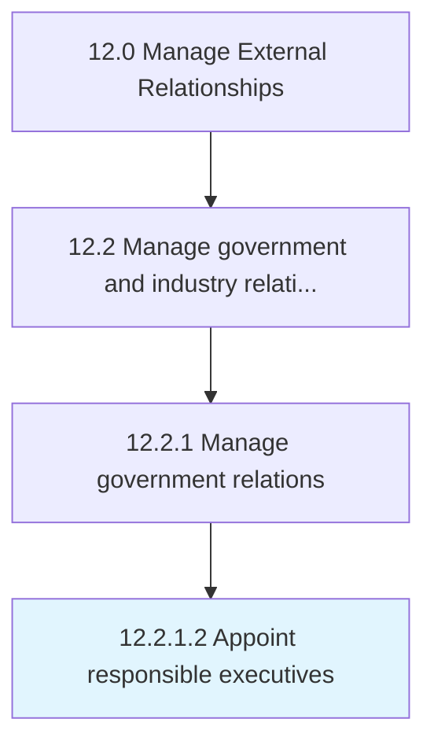

# Appoint responsible executives

> Assigning executive level resources to manage, grow, and drive relationships with government bodies.

## Overview

Activity 12.2.1.2 is an activity within the Manage External Relationships framework. 

Assigning executive level resources to manage, grow, and drive relationships with government bodies.

## Process Hierarchy



## Key Statistics

| Metric | Value |
|--------|-------|
| APQC Code | 12870 |
| Hierarchy ID | 12.2.1.2 |
| Level | Activity |
| Parent | [12.2.1](../) |
| Sub-Processes | 0 |


## GraphDL Semantic Structure

```
appoint.ResponsibleExecutives
```

| Component | Value | Description |
|-----------|-------|-------------|
| Verb | `appoint` | Primary action |
| Object | `responsible executives` | Direct object |


## Related Concepts

- [ResponsibleExecutives](/concepts/ResponsibleExecutives)


---

*Source: APQC PCF 12870 (12.2.1.2) - APQC*
