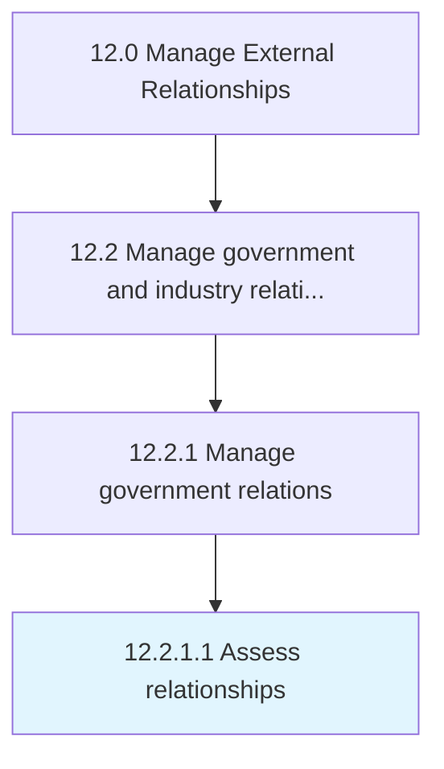

# Assess relationships

> Ascertaining how the business entity relates to all levels of government.

## Overview

Activity 12.2.1.1 is an activity within the Manage External Relationships framework. 

Ascertaining how the business entity relates to all levels of government. Identify areas that needs further growth and resources to foster those relationships.

## Process Hierarchy



## Key Statistics

| Metric | Value |
|--------|-------|
| APQC Code | 12869 |
| Hierarchy ID | 12.2.1.1 |
| Level | Activity |
| Parent | [12.2.1](../) |
| Sub-Processes | 0 |


## GraphDL Semantic Structure

```
assess.Relationships
```

| Component | Value | Description |
|-----------|-------|-------------|
| Verb | `assess` | Primary action |
| Object | `relationships` | Direct object |


## Related Concepts

- Relationships


---

*Source: APQC PCF 12869 (12.2.1.1) - APQC*
