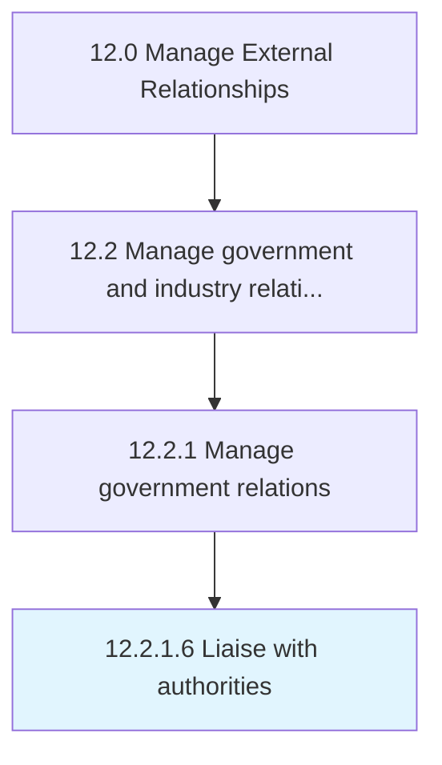

# Liaise with authorities

> Meeting with government heads and representatives.

## Overview

Activity 12.2.1.6 is an activity within the Manage External Relationships framework. 

## Process Hierarchy



## Key Statistics

| Metric | Value |
|--------|-------|
| APQC Code | 12874 |
| Hierarchy ID | 12.2.1.6 |
| Level | Activity |
| Parent | [12.2.1](../) |
| Sub-Processes | 0 |


## GraphDL Semantic Structure

```
liaise.WithAuthorities
```

| Component | Value | Description |
|-----------|-------|-------------|
| Verb | `liaise` | Primary action |
| Object | `with authorities` | Direct object |


## Related Concepts

- Authorities


---

*Source: APQC PCF 12874 (12.2.1.6) - APQC*
