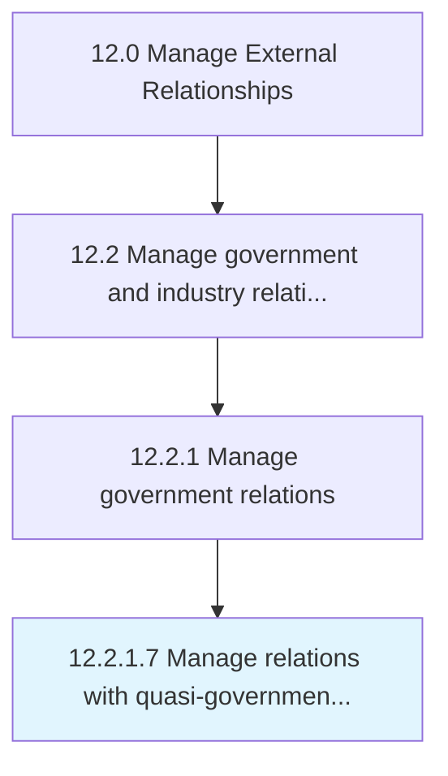

# Manage relations with quasi-government bodies

> Managing relations with quasi-governmental organizations, corporations, businesses, or any other agency that is treated by national laws and principles to be under the supervision of the government but also distinct and self-directed from the government.

## Overview

The manage relations with quasi-government bodies process is a critical component of the External Relationships function within an organization. It encompasses the systematic approach to manage relations with quasi-government bodies, ensuring that all activities are performed consistently, efficiently, and in alignment with organizational objectives. This process establishes the framework through which manage relations with quasi-government bodies is executed, monitored, and continuously improved to deliver value across the enterprise.

Within the APQC Process Classification Framework (hierarchy 12.2.1.7), this activity supports the broader "Manage External Relationships" category. Effective execution requires cross-functional collaboration, clear accountability, and robust governance mechanisms. Organizations that mature this process typically see improved operational performance, reduced risk exposure, and stronger alignment between tactical activities and strategic goals.


## Process Hierarchy


```mermaid
graph TD
    C12["12.0 Manage External Relationships"]
    C12 --> N12_2["12.2 Manage government and industry relati..."]
    N12_2 --> N12_2_1["12.2.1 Manage government relations"]
    N12_2_1 --> N12_2_1_7["12.2.1.7 Manage relations with quasi-governmen..."]
    style N12_2_1_7 fill:#e1f5fe
```

## Key Statistics

| Metric | Value |
|--------|-------|
| APQC Code | 11039 |
| Hierarchy ID | 12.2.1.7 |
| Level | Activity |
| Parent | [12.2.1](../) |
| Sub-Processes | 0 |


## GraphDL Semantic Structure

```
manage.Relations.with.QuasigovernmentBodies
```

| Component | Value | Description |
|-----------|-------|-------------|
| Verb | `manage` | Primary action |
| Object | `relations` | Direct object |
| Preposition | `with` | Relationship |
| PrepObject | `quasi-government bodies` | Indirect object |


---

*Source: APQC PCF 11039 (12.2.1.7) - APQC*
