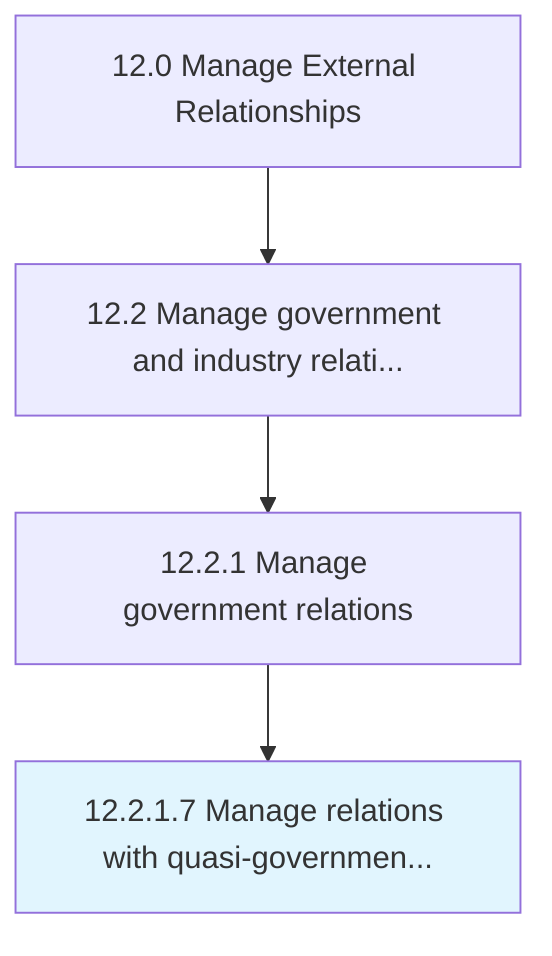

# Manage relations with quasi-government bodies

> Managing relations with quasi-governmental organizations, corporations, businesses, or any other agency that is treated by national laws and principles to be under the supervision of the government but also distinct and self-directed from the government.

## Overview

Activity 12.2.1.7 is an activity within the Manage External Relationships framework. 

Managing relations with quasi-governmental organizations, corporations, businesses, or any other agency that is treated by national laws and principles to be under the supervision of the government but also distinct and self-directed from the government.

## Process Hierarchy



## Key Statistics

| Metric | Value |
|--------|-------|
| APQC Code | 11039 |
| Hierarchy ID | 12.2.1.7 |
| Level | Activity |
| Parent | [12.2.1](../) |
| Sub-Processes | 0 |


## GraphDL Semantic Structure

```
manage.Relations.with.QuasigovernmentBodies
```

| Component | Value | Description |
|-----------|-------|-------------|
| Verb | `manage` | Primary action |
| Object | `relations` | Direct object |
| Preposition | `with` | Relationship |
| PrepObject | `quasi-government bodies` | Indirect object |


---

*Source: APQC PCF 11039 (12.2.1.7) - APQC*
