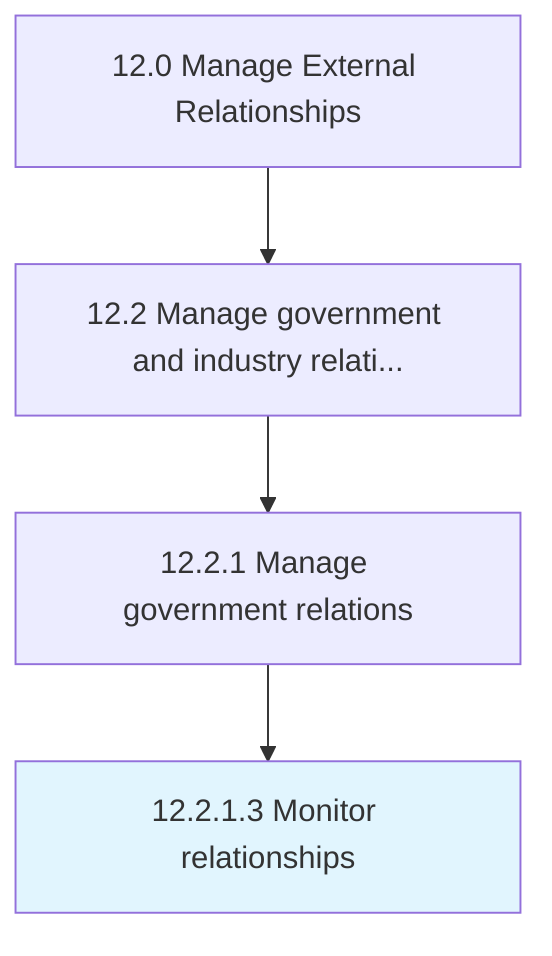

# Monitor relationships

> Analyzing current relationships with government bodies and entities.

## Overview

Activity 12.2.1.3 is an activity within the Manage External Relationships framework. 

Analyzing current relationships with government bodies and entities.

## Process Hierarchy



## Key Statistics

| Metric | Value |
|--------|-------|
| APQC Code | 12871 |
| Hierarchy ID | 12.2.1.3 |
| Level | Activity |
| Parent | [12.2.1](../) |
| Sub-Processes | 0 |


## GraphDL Semantic Structure

```
monitor.Relationships
```

| Component | Value | Description |
|-----------|-------|-------------|
| Verb | `monitor` | Primary action |
| Object | `relationships` | Direct object |


## Related Concepts

- Relationships


---

*Source: APQC PCF 12871 (12.2.1.3) - APQC*
