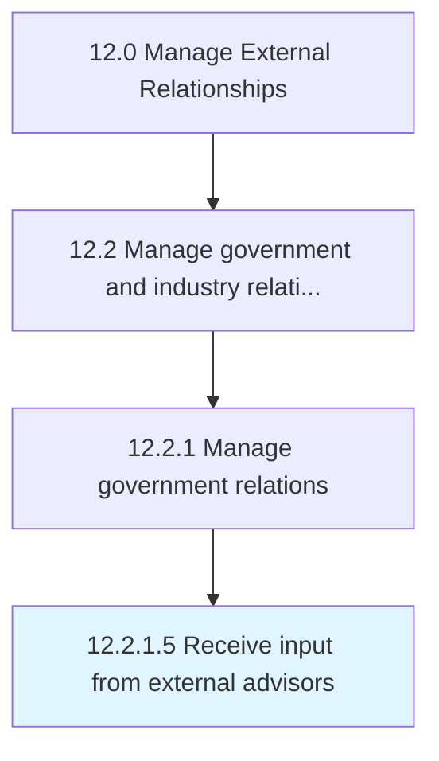

# Receive input from external advisors

> Garnering third party advice from an informal group in order to successfully maintain and advance relationships.

## Overview

Activity 12.2.1.5 is an activity within the Manage External Relationships framework. 

Garnering third party advice from an informal group in order to successfully maintain and advance relationships.

## Process Hierarchy



## Key Statistics

| Metric | Value |
|--------|-------|
| APQC Code | 12873 |
| Hierarchy ID | 12.2.1.5 |
| Level | Activity |
| Parent | [12.2.1](../) |
| Sub-Processes | 0 |


## GraphDL Semantic Structure

```
receive.Input.from.ExternalAdvisors
```

| Component | Value | Description |
|-----------|-------|-------------|
| Verb | `receive` | Primary action |
| Object | `input` | Direct object |
| Preposition | `from` | Relationship |
| PrepObject | `external advisors` | Indirect object |


## Related Concepts

- [Input](/concepts/Input)
- [ExternalAdvisors](/concepts/ExternalAdvisors)


---

*Source: APQC PCF 12873 (12.2.1.5) - APQC*
